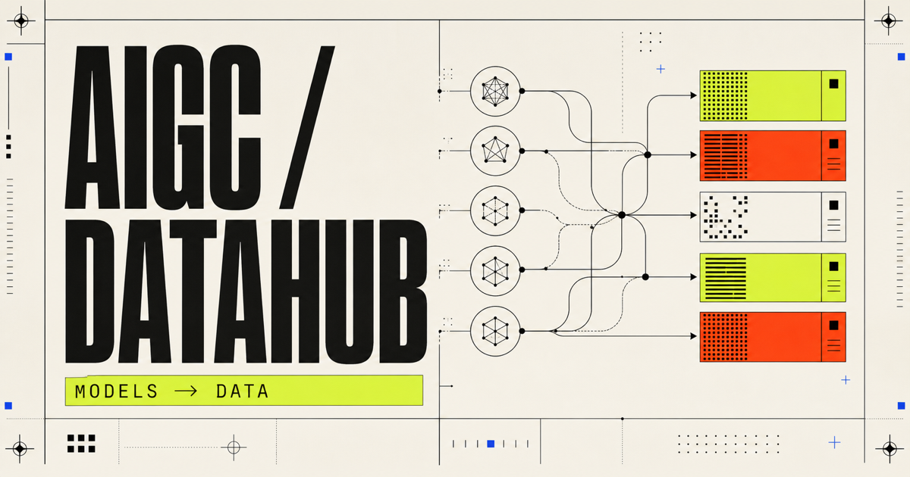

# AIGCDataHub

[English](README.md) · [简体中文](README.zh-CN.md)



**Trace generative AI models back to their data.** AIGCDataHub is an
evidence-backed, continuously maintained catalog of multimodal models, datasets,
training stages, processing strategies, access conditions, and data lineage.

[](https://github.com/TobinZuo/AIGCDataHub/actions/workflows/validate.yml)
[](LICENSE)
[](https://github.com/TobinZuo/AIGCDataHub/stargazers)

**[Explore the live catalog](https://tobinzuo.github.io/AIGCDataHub/)** ·
**[Read the latest changes](https://tobinzuo.github.io/AIGCDataHub/changelog/)** ·
**[Find downloadable datasets](DATASET_ACCESS_INDEX.md)** ·
**[Inspect model–dataset lineage](MODEL_DATASET_INDEX.md)**

<!-- BEGIN PROJECT METRICS -->
| Models | Datasets | Model–dataset links | Dataset lineage | Open access | Latest review |
|:---:|:---:|:---:|:---:|:---:|:---:|
| 113 | 182 | 200 | 42 | 72 | 2026-08-05 |
<!-- END PROJECT METRICS -->

> [!NOTE]
> This is not another “awesome” link list. Every card preserves release and
> verification dates, distinguishes training from evaluation and runtime data,
> resolves named public datasets to access links, and records material
> undisclosed fields instead of inferring them from model behavior.

## Why AIGCDataHub

| Question | What this repository provides |
|---|---|
| What data did a model actually name? | Source-backed training, fine-tuning, preference, evaluation, and inherited-data references. |
| Can I access it? | Direct download, browse, request, API, or explicit unavailable/not-released status. |
| How was it processed? | Disclosed filtering, deduplication, recaptioning, synthesis, and preference-optimization operations. |
| What remains unknown? | Missing sources, rights, mixture ratios, scale, and stage details are retained as findings. |
| What changed recently? | Daily official-source monitoring, reviewed update records, and versioned Git history. |

## Start here on GitHub

The repository is the source of truth. These links work entirely inside GitHub
and do not depend on a separate preview host:

- **[Dataset downloads and access status](DATASET_ACCESS_INDEX.md)** — one row
  per dataset, including direct download/browse links and access restrictions.
- **[Model ↔ dataset relationships](MODEL_DATASET_INDEX.md)** — bidirectional
  training, fine-tuning, preference, evaluation, and inherited-data lineage.
- **[Latest model cards](models/)** and **[dataset cards](catalog/)** — the
  structured YAML records behind every generated index.
- **[Monitoring and update log](updates/)** — reviewed changes from official
  model, paper, repository, dataset, and ranking sources.

The optional [interactive GitHub Pages view](https://tobinzuo.github.io/AIGCDataHub/)
is built from the same `master` data.

## Use the data in 60 seconds

The generated site payload is a version-controlled JSON snapshot. Query one
model and its disclosed data references directly from the default branch:

```bash
curl -sL https://raw.githubusercontent.com/TobinZuo/AIGCDataHub/master/site/app/catalog-data.json \
  | jq '.models[] | select(.id == "id-v2v") | {name, released_at, access, datasets: .data.datasets}'
```

For reproducible downstream use, pin a commit or a published release instead of
tracking `master`.

> [!IMPORTANT]
> A dataset being publicly downloadable does not imply that every underlying
> media asset can be used for training, commercial purposes, or redistribution.
> Each data card separates metadata terms from media rights and records unknowns
> explicitly. This repository is an engineering reference, not legal advice.

## Scope

The current scope covers:

- current image, video, audio-video, and unified multimodal models;
- the public, gated, internal, synthetic, and undisclosed data behind each model;
- image, video, audio, 3D, and preference datasets;
- candidate video, stock-media, studio, and e-commerce source platforms, kept
  separate from downloadable dataset releases;
- scenario-first coverage for image/video generation, digital humans, video
  localization, and virtual try-on;
- data engineering: acquisition, validation, filtering, deduplication,
  recaptioning, sharding, and loading;
- quality and governance: alignment, visual quality, motion, safety, privacy,
  provenance, licensing, and redistribution constraints.

Text-only LLM corpora are intentionally out of scope.

## Latest models and data strategies

Model cards link architecture and release information to the disclosed training
stages, named datasets, source types, curation operations, and material unknowns.
“Undisclosed” is a result: the catalog never invents a training dataset from a
model's capabilities or outputs. The table is sorted by model release date,
newest first.

<details>
<summary><strong>Browse the full model catalog</strong></summary>

<!-- BEGIN MODEL CATALOG -->
| Model | Organization | Modalities | Released | Access | Data disclosure | Named datasets | Status |
|---|---|---|---|---|---|---|:---:|
| [JoyAI-Video-Edit](models/video/joyai-video-edit.yaml) | JD Open Source | video, image | 2026-08-04 | open weights | partial | Unnamed text-to-image pretraining corpus, Unnamed text-to-video pretraining and post-training corpus, Unnamed image-editing corpus, Synthetic bidirectional video-editing pairs, [OpenVE-Bench](catalog/evaluation/openve-bench.yaml), [LongV2VBench](catalog/evaluation/longv2vbench.yaml) | 🟡 |
| [QuerySplat](models/3d/querysplat.yaml) | inspatio | 3d, image | 2026-08-02 | open weights | partial | [DL3DV-10K](catalog/video/dl3dv-10k.yaml), [DL3DV-Evaluation](catalog/3d/dl3dv-evaluation.yaml) | 🟡 |
| [Seedance 2.5](models/video/seedance-2-5.yaml) | ByteDance Seed | video, audio | 2026-07-31 | product only | undisclosed | not disclosed | 👀 |
| [Qwen-Image-SP](models/image/qwen-image-sp.yaml) | ByteDance Seed | image | 2026-07-31 | open weights | partial | [Context Scaling SP/NL Image Corpus](catalog/image/context-scaling-sp-nl-corpus.yaml), [Context Scaling Prompter SFT Corpus](catalog/image/context-scaling-prompter-sft-corpus.yaml), [Context Scaling Cold-Start Corpus](catalog/image/context-scaling-cold-start-corpus.yaml), [Context Scaling RFT Pairs](catalog/preference/context-scaling-rft-pairs.yaml), [Context Scaling 30K Evaluation Pairs](catalog/evaluation/context-scaling-30k-evaluation-pairs.yaml) | 🟡 |
| [MoRoute](models/video/moroute.yaml) | Sun Yat-sen University, Orange 3DV Team, Moku Lab, and HUJING | video | 2026-07-31 | announced | partial | [MoRoute LAION-2B Stage-1 Subset](catalog/image/moroute-laion-2b-subset.yaml), [Vchitect T2V DataVerse](catalog/video/vchitect-t2v-dataverse.yaml), [MoRoute Internal T2V Corpus](catalog/video/moroute-internal-t2v-corpus.yaml), [OpenVE-3M](catalog/video/openve-3m.yaml), [Ditto-1M](catalog/video/ditto-1m.yaml), [EffectErase Dataset](catalog/video/effecterase.yaml), [MoRoute UE5 Editing Pairs](catalog/video/moroute-ue5-editing-pairs.yaml), [IntelligentVBench](catalog/evaluation/intelligentvbench.yaml), [OpenVE-Bench](catalog/evaluation/openve-bench.yaml), [RefVIE-Bench](catalog/evaluation/refvie-bench.yaml) | 👀 |
| [MiniMax H3](models/multimodal/minimax-h3.yaml) | MiniMax | video, image, audio | 2026-07-31 | api only | undisclosed | not disclosed | 🟡 |
| [ShadowDancer](models/video/shadowdancer.yaml) | Alaya Lab and Shanghai Innovation Institute | video, action | 2026-07-30 | announced | partial | [Shadow Library](catalog/video/shadow-library.yaml) | 👀 |
| [S-Avatar](models/image/s-avatar.yaml) | Korea Advanced Institute of Science and Technology | image, 3d | 2026-07-30 | announced | partial | [NeRSemble](catalog/3d/nersemble.yaml) | 👀 |
| [ReMind 5B](models/video/remind.yaml) | Applied Intuition Research | video, action | 2026-07-30 | open weights | partial | [ReMind1M](catalog/video/remind1m.yaml), [OpenVid-1M](catalog/video/openvid-1m.yaml), [DL3DV-10K](catalog/video/dl3dv-10k.yaml), [ReMind Pexels dynamic clips](catalog/video/remind-pexels-dynamic-clips.yaml) | 🟡 |
| [LeapTalk](models/video/leaptalk.yaml) | LeapTalk Authors | video, audio, image | 2026-07-29 | open weights | partial | Wan2.1-T2V-1.3B inherited pretraining mixture, [VividHead](catalog/video/vividhead.yaml), [HDTF](catalog/video/hdtf.yaml), [CelebV-HQ](catalog/video/celebv-hq.yaml) | 🟡 |
| [Wonder](models/video/wonder.yaml) | Adobe Research and Johns Hopkins University | video | 2026-07-28 | announced | partial | Wan2.1 inherited pretraining mixture, [DL3DV-10K](catalog/video/dl3dv-10k.yaml), [MultiCamVideo Dataset](catalog/video/multicamvideo.yaml), [CamXTime](catalog/video/camxtime.yaml), [Wonder UE I2V Corpus](catalog/video/wonder-ue-i2v-corpus.yaml), [Wonder Blender V2V Corpus](catalog/video/wonder-blender-v2v-corpus.yaml), [Wonder I2V Benchmark](catalog/evaluation/wonder-i2v-benchmark.yaml), [Wonder V2V Benchmark](catalog/evaluation/wonder-v2v-benchmark.yaml) | 👀 |
| [JoyFox LiveTalk-DH 1.3B](models/video/joyfox-livetalk-dh-1-3b.yaml) | JoyFox | video, audio, image | 2026-07-28 | open weights | high level | not disclosed | 🟡 |
| [UniGen-AR](models/multimodal/unigen-ar.yaml) | Carnegie Mellon University and University of Illinois Urbana-Champaign | image | 2026-07-27 | announced | full | [LAION-COCO-Aesthetic](catalog/image/laion-coco-aesthetic.yaml), [Graph200K](catalog/image/graph200k.yaml), [RefCOCO](catalog/image/refcoco.yaml), [OmniEdit-Filtered-1.2M](catalog/image/omniedit-filtered-1-2m.yaml), [StyleBooth Dataset](catalog/image/stylebooth.yaml), [UniGen-AR evaluation suite](catalog/evaluation/unigen-ar-evaluation-suite.yaml) | 👀 |
| [fMRI2Face](models/video/fmri2face.yaml) | Fudan University | video | 2026-07-24 | announced | partial | [fMRI-Face](catalog/video/fmri-face.yaml) | 👀 |
| [Midjourney V8.2](models/image/midjourney-v8-2.yaml) | Midjourney | image | 2026-07-24 | product only | high level | V8.2 personalization ratings and image-selection pool | 👀 |
| [InnoText](models/image/innotext.yaml) | InnoText research team | image | 2026-07-24 | announced | partial | [InnoText-30K](catalog/image/innotext-30k.yaml) | 👀 |
| [ID-V2V](models/video/id-v2v.yaml) | Netflix and Eyeline Labs | video, image | 2026-07-24 | open weights | partial | [ID-V2V Human-Centric Video Corpus](catalog/video/id-v2v-human-centric-videos.yaml), [ID-V2V Face Relighting Pairs](catalog/image/id-v2v-face-relighting-pairs.yaml), [ID-V2V Evaluation Suite](catalog/evaluation/id-v2v-evaluation-suite.yaml) | 🟡 |
| [AgentHOI](models/video/agenthoi.yaml) | AgentHOI research team | video | 2026-07-24 | open weights | partial | [AgentHOI Mixed-Source Training Corpus](catalog/video/agenthoi-mixed-source-corpus.yaml) | 🟡 |
| [WorldWeaver](models/video/worldweaver.yaml) | UCLA and Adobe Research | video, action | 2026-07-23 | announced | partial | Inherited single-player video diffusion prior training mixture, [WorldWeaver Minecraft 126h](catalog/video/worldweaver-minecraft-126h.yaml), [Solaris Eval Datasets](catalog/evaluation/solaris-eval-datasets.yaml) | 👀 |
| [SANA-Video 2.0](models/video/sana-video-2-0.yaml) | NVIDIA | video | 2026-07-23 | research preview | partial | [Curated in-house image and video training pool](catalog/video/sana-video-2-progressive-training-pools.yaml), [Gemini-ranked generated video preference pairs](catalog/preference/sana-video-2-preference-pairs.yaml) | 👀 |
| [Oxygen-TryOn](models/image/oxygen-tryon.yaml) | Team Oxygen | image | 2026-07-23 | announced | partial | [Oxygen-TryOn Training Corpus](catalog/image/oxygen-tryon-training-corpus.yaml), [Oxygen-TryOn Preference Pairs](catalog/preference/oxygen-tryon-preference-pairs.yaml), [Oxygen-TryOn Bench](catalog/evaluation/oxygen-tryon-bench.yaml) | 🟡 |
| [GraphVid](models/video/graphvid.yaml) | University of Illinois Urbana-Champaign and Sony Research India | video | 2026-07-23 | announced | partial | LTX-Video base-model training mixture, [GraphVid-Bench](catalog/video/graphvid-bench.yaml) | 👀 |
| [FLUX 3](models/multimodal/flux-3.yaml) | Black Forest Labs | image, video, audio, action | 2026-07-23 | api only | partial | General video training corpus, Human and robot manipulation video corpus, Robot action demonstrations | 👀 |
| [ElasticTTT](models/video/elasticttt.yaml) | Tsinghua University and Beijing Academy of Artificial Intelligence | video | 2026-07-23 | research preview | partial | Wan base-model training mixture, User-provided source video, [ElasticTTT Video Editing Dataset](catalog/evaluation/elasticttt-video-editing.yaml) | 👀 |
| [Qwen Image 3.0 Pro](models/image/qwen-image-3-0-pro.yaml) | Alibaba Cloud | image | 2026-07-21 | early access | undisclosed | not disclosed | 👀 |
| [Mage-Flow](models/image/mage-flow.yaml) | Microsoft Mage Team | image | 2026-07-21 | open weights | partial | [Mage-Flow curated image-text corpus](catalog/image/mage-flow-curated-image-text.yaml), [Mage-Flow-Edit training triples](catalog/image/mage-flow-edit-triples.yaml), [Mage-Flow capability-routed RL prompt pools](catalog/preference/mage-flow-rl-prompt-pools.yaml) | ✅ |
| [InfiniSplat](models/3d/infinisplat.yaml) | PLUS-WAVE | 3d, image | 2026-07-20 | open weights | partial | [Hypersim](catalog/3d/hypersim.yaml), [ETH3D](catalog/3d/eth3d.yaml), [ScanNet++](catalog/3d/scannet-plus-plus.yaml), [Tanks and Temples](catalog/3d/tanks-and-temples.yaml), [DL3DV-10K](catalog/video/dl3dv-10k.yaml) | 🟡 |
| [Seedream 5.0 Pro](models/image/seedream-5-0-pro.yaml) | ByteDance Seed | image | 2026-07-17 | api only | undisclosed | not disclosed | 👀 |
| [CtrlVTON](models/image/ctrlvton.yaml) | NXN Labs and KAIST | image | 2026-07-10 | announced | partial | FLUX.2 Klein inherited pretraining mixture, VIP-Seg fashion segmentation dataset, CtrlVTON training corpus, [VITON-HD-edit](catalog/image/viton-hd-edit.yaml) | 👀 |
| [Reve 2.1](models/image/reve-2-1.yaml) | Reve | image | 2026-07-09 | api only | undisclosed | not disclosed | 👀 |
| [Muse Video](models/video/muse-video.yaml) | Meta Superintelligence Labs | video, audio | 2026-07-07 | announced | high level | not disclosed | 👀 |
| [Muse Image](models/multimodal/muse-image.yaml) | Meta Superintelligence Labs | image | 2026-07-07 | product only | high level | not disclosed | 👀 |
| [Gemini Omni Flash](models/video/gemini-omni-flash.yaml) | Google DeepMind | video, audio | 2026-06-30 | api only | high level | Undisclosed multimodal training mixture | ✅ |
| [Gemini 3.1 Flash-Lite Image](models/image/gemini-3-1-flash-lite-image.yaml) | Google DeepMind | image | 2026-06-30 | api only | high level | Gemini 3 family multimodal training mixture | ✅ |
| [Vera-14B](models/video/vera-14b.yaml) | Netflix and California Institute of Technology | video | 2026-06-22 | research preview | partial | Wan2.1-14B base-model training mixture, [Vera Layered Video Dataset](catalog/video/vera-layered-video.yaml), [VideoMatte240K](catalog/video/videomatte240k.yaml) | ✅ |
| [HappyHorse 1.1](models/video/happyhorse-1-1.yaml) | Alibaba ATH | video, audio | 2026-06-22 | api only | undisclosed | not disclosed | 👀 |
| [SeFi-Image](models/image/sefi-image.yaml) | SeFi-Team | image | 2026-06-21 | gated weights | partial | [SeFi-Image Internal Pretraining Corpus](catalog/image/sefi-image-internal-pretraining-corpus.yaml), [SeFi-Image Synthetic Text-Rendered Corpus](catalog/image/sefi-image-synthetic-text-rendered-corpus.yaml), [Fine-T2I](catalog/image/fine-t2i.yaml), [SeFi-Image Continual-Training Mixture](catalog/image/sefi-image-continual-training-mixture.yaml), [SeFi-Image SFT Corpus](catalog/image/sefi-image-sft-corpus.yaml), [SeFi-Image DiffusionNFT Prompt Pool](catalog/preference/sefi-image-diffusionnft-prompt-pool.yaml) | 🟡 |
| [Grok Imagine Video 1.5](models/video/grok-imagine-video-1-5.yaml) | xAI | video, audio | 2026-06-16 | api only | undisclosed | not disclosed | 👀 |
| [HiDream-O1-Image-1.5](models/image/hidream-o1-image-1-5.yaml) | HiDream.ai | image | 2026-06-09 | product only | high level | HiDream O1 heterogeneous visual corpus | 🟡 |
| [HoliDubber](models/video/holidubber.yaml) | HoliDubber research team | video, audio | 2026-06-08 | announced | partial | HoliDubber Audio-VAE heterogeneous mixture, [Emilia](catalog/audio/emilia.yaml), HoliDubber structured audio pretraining mixture, [VoxCeleb2](catalog/video/voxceleb2.yaml), [CelebV-Dub](catalog/video/celebv-dub.yaml), [HoliDub-Bench](catalog/evaluation/holidub-bench.yaml) | 🟡 |
| [OmniTryOn](models/video/omnitryon.yaml) | Xi'an Jiaotong University | video | 2026-06-05 | open weights | partial | Wan2.1-I2V-14B and Video-As-Prompt inherited training mixture, [TryAny-Bench](catalog/video/tryany-bench.yaml) | ✅ |
| [Reve 2.0](models/image/reve-2.yaml) | Reve | image | 2026-06-03 | api only | undisclosed | not disclosed | 👀 |
| [Ideogram 4.0](models/image/ideogram-4.yaml) | Ideogram | image | 2026-06-03 | gated weights | high level | not disclosed | ✅ |
| [MAI-Image-2.5](models/image/mai-image-2-5.yaml) | Microsoft AI | image | 2026-06-02 | api only | undisclosed | not disclosed | 👀 |
| [Cosmos3-Super-Text2Image](models/image/cosmos3-super-text2image.yaml) | NVIDIA | image | 2026-05-31 | open weights | high level | Cosmos 3 multimodal generator corpus | ✅ |
| [GPIC Baseline Models](models/image/gpic-baselines.yaml) | Stanford Vision Lab and collaborators | image | 2026-05-28 | open weights | partial | [GPIC](catalog/image/gpic.yaml) | 🟡 |
| [FLUX VTO](models/image/flux-vto.yaml) | Black Forest Labs | image | 2026-05-28 | api only | undisclosed | not disclosed | 👀 |
| [Runway Aleph 2.0](models/video/runway-aleph-2.yaml) | Runway | video | 2026-05-21 | product only | undisclosed | not disclosed | 👀 |
| [iTryOn](models/video/itryon.yaml) | Sun Yat-sen University and Alibaba Group | video | 2026-05-20 | announced | partial | Wan2.1-VACE inherited pretraining mixture, [ViViD](catalog/video/vivid.yaml), [VVT-Interact](catalog/video/vvt-interact.yaml) | ✅ |
| [Lens](models/image/lens.yaml) | Microsoft Research | image | 2026-05-20 | open weights | partial | [Lens-800M](catalog/image/lens-800m.yaml), [Lens-RL-8K](catalog/preference/lens-rl-8k.yaml) | ✅ |
| [Lance](models/multimodal/lance.yaml) | ByteDance | image, video | 2026-05-18 | open weights | high level | not disclosed | ✅ |
| [InstructAV2AV](models/video/instructav2av.yaml) | Nanyang Technological University and MMLab, The Chinese University of Hong Kong | video, audio | 2026-05-18 | open weights | partial | [InsAVE-80K](catalog/video/insave-80k.yaml), [AvED-Bench](catalog/evaluation/aved-bench.yaml) | 🟡 |
| [Recraft V4.1](models/image/recraft-v4-1.yaml) | Recraft | image | 2026-05-14 | api only | undisclosed | not disclosed | 👀 |
| [HiDream-O1-Image](models/image/hidream-o1-image.yaml) | HiDream.ai | image | 2026-05-08 | open weights | partial | HiDream O1 heterogeneous visual corpus | ✅ |
| [Grok Imagine Image Quality](models/image/grok-imagine-image-quality.yaml) | xAI | image | 2026-05-06 | api only | undisclosed | not disclosed | 👀 |
| [Luma UNI 1 Max](models/image/luma-uni-1-max.yaml) | Luma AI | image | 2026-05-05 | api only | high level | Luma UNI creative training corpus | 👀 |
| [TripVVT](models/video/tripvvt.yaml) | Nanjing University, JIUTIAN Research (CMCC), Jilin University, and ByteDance | video | 2026-04-30 | announced | partial | Wan2.1-Fun-14B-control inherited pretraining mixture, TripVVT supplementary training set, [TripVVT-10K](catalog/video/tripvvt-10k.yaml) | ✅ |
| [HappyHorse 1.0](models/video/happyhorse-1-0.yaml) | Alibaba ATH | video, audio | 2026-04-27 | api only | undisclosed | not disclosed | 👀 |
| [GPT Image 2](models/image/gpt-image-2.yaml) | OpenAI | image | 2026-04-21 | api only | undisclosed | not disclosed | 👀 |
| [ERNIE-Image](models/image/ernie-image.yaml) | Baidu | image | 2026-04-15 | open weights | partial | Internal large-scale image pool, [ERIA-1K](catalog/evaluation/eria-1k.yaml) | ✅ |
| [Fit-VTO](models/image/fit-vto.yaml) | University of Washington and Google Research | image | 2026-04-09 | research preview | partial | FLUX.1-dev inherited pretraining mixture, Full FIT training collection, [FIT-VTO-100K](catalog/image/fit-vto-100k.yaml) | ✅ |
| [Avatar V](models/video/avatar-v.yaml) | HeyGen Research | video, audio | 2026-04-08 | product only | partial | Avatar V general video pretraining corpus, Avatar V audio-to-video fine-tuning corpus, Avatar V human preference data | ✅ |
| [Wan 2.7](models/video/wan-2-7.yaml) | Alibaba Cloud | video, audio | 2026-04-03 | api only | undisclosed | not disclosed | 👀 |
| [Veo 3.1 Lite](models/video/veo-3-1-lite.yaml) | Google DeepMind | video, audio | 2026-03-31 | api only | undisclosed | not disclosed | 👀 |
| [PixVerse V6](models/video/pixverse-v6.yaml) | PixVerse | video, audio | 2026-03-30 | api only | undisclosed | not disclosed | 👀 |
| [DiFlowDubber](models/video/diflowdubber.yaml) | FPT Software AI Center, KAIST, and University of Alabama at Birmingham | video, audio | 2026-03-15 | announced | partial | [LibriTTS](catalog/audio/libritts.yaml), [Chem](catalog/video/chem.yaml), [GRID audiovisual sentence corpus](catalog/video/grid.yaml) | 🟡 |
| [UniSync](models/video/unisync.yaml) | Mango TV | video, audio | 2026-03-04 | announced | partial | [UniSync 5K training set](catalog/video/unisync-5k.yaml), [HDTF](catalog/video/hdtf.yaml), [RealWorld-LipSync](catalog/evaluation/realworld-lipsync.yaml) | 👀 |
| [Helios](models/video/helios.yaml) | PKU-YuanGroup | video | 2026-03-04 | open weights | partial | Wan2.1 inherited pretraining mixture, [Helios Training Corpus](catalog/video/helios-training-corpus.yaml), [Helios ODE Solution Pairs](catalog/video/helios-ode-solution-pairs.yaml), [HeliosBench](catalog/evaluation/heliosbench.yaml) | 🟡 |
| [Gemini 3.1 Flash Image (Nano Banana 2)](models/image/gemini-3-1-flash-image.yaml) | Google DeepMind | image | 2026-02-26 | api only | undisclosed | [AVGen-Bench](catalog/evaluation/avgen-bench.yaml) | 👀 |
| [Solaris](models/video/solaris.yaml) | New York University VISIONx | video, action | 2026-02-25 | open weights | partial | Matrix Game 2.0 inherited pretraining mixture, [VPT Contractor Demonstrations](catalog/video/vpt-contractor-demonstrations.yaml), [Solaris Training Dataset](catalog/video/solaris-training-dataset.yaml), [Solaris Eval Datasets](catalog/evaluation/solaris-eval-datasets.yaml) | ✅ |
| [SkyReels V4](models/video/skyreels-v4.yaml) | Skywork AI | video, audio | 2026-02-25 | api only | partial | [LAION (version not specified)](catalog/image/re-laion-5b.yaml), [Flickr](catalog/image/flickr-5b.yaml), [WebVid-10M](catalog/video/webvid-10m.yaml), [Koala-36M](catalog/video/koala-36m.yaml), [OpenHumanVid](catalog/video/openhumanvid.yaml), [Emilia](catalog/audio/emilia.yaml), [AudioSet](catalog/audio/audioset.yaml), [VGGSound](catalog/audio/vggsound.yaml), [SoundNet](catalog/audio/soundnet.yaml), Licensed SkyReels film and web-video corpus, Synthetic multilingual and editing corpora | ✅ |
| [LTX-2.3](models/multimodal/ltx-2-3.yaml) | Lightricks | video, audio | 2026-02-23 | open weights | partial | Audio-informative subset of the LTX-Video training corpus, Higher-quality VAE training subset, [AVGen-Bench](catalog/evaluation/avgen-bench.yaml) | ✅ |
| [Seedance 2.0](models/video/seedance-2-0.yaml) | ByteDance Seed | video, audio | 2026-02-12 | api only | undisclosed | [AVGen-Bench](catalog/evaluation/avgen-bench.yaml) | 👀 |
| [Qwen-Image 2.0](models/image/qwen-image-2.yaml) | Qwen Team | image | 2026-02-10 | api only | undisclosed | not disclosed | 👀 |
| [JUST-DUB-IT](models/video/just-dub-it.yaml) | Lightricks and Tel Aviv University | video, audio | 2026-02-10 | gated weights | partial | LTX-2 base-model training mixture, [Audiovisual Translation Dubbing Dataset](catalog/video/audiovisual-translation-dub.yaml) | ✅ |
| [ConsID-Gen](models/video/consid-gen.yaml) | Texas A&M University and eBay | video | 2026-02-10 | open weights | partial | Wan2.1-Fun-1.3B-InP inherited pretraining mixture, [CO3D](catalog/video/co3d.yaml), [OmniObject3D](catalog/3d/omniobject3d.yaml), [Objectron](catalog/video/objectron.yaml), [MVImgNet 2.0](catalog/3d/mvimgnet-2-0.yaml), [ConsIDVid Public Release](catalog/video/considvid.yaml), Unreleased e-commerce UGC supplement, ConsIDVid-Bench proprietary subset | ✅ |
| [Kling AI 3.0](models/video/kling-3.yaml) | Kuaishou Technology | video, audio, image | 2026-02-05 | product only | undisclosed | not disclosed | 👀 |
| [MOVA-720p](models/video/mova-720p.yaml) | OpenMOSS | video, audio | 2026-01-29 | open weights | partial | [AutoReCap-XL](catalog/audio/autorecap-xl.yaml), [ChronoMagic-Pro](catalog/video/chronomagic-pro.yaml), [ACAV100M](catalog/video/acav100m.yaml), [OpenHumanVid](catalog/video/openhumanvid.yaml), [SpeakerVid-5M](catalog/video/speakervid-5m.yaml), [OpenVid-1M](catalog/video/openvid-1m.yaml), [VGGSound](catalog/audio/vggsound.yaml), [WavCaps](catalog/audio/wavcaps.yaml), [JamendoMaxCaps](catalog/audio/jamendomaxcaps.yaml), MOVA in-house audio-video and TTS corpora, [AVGen-Bench](catalog/evaluation/avgen-bench.yaml) | ✅ |
| [Grok Imagine Video](models/video/grok-imagine-video.yaml) | xAI | video, audio | 2026-01-28 | api only | undisclosed | not disclosed | 👀 |
| [Grok Imagine Image](models/image/grok-imagine-image.yaml) | xAI | image | 2026-01-28 | api only | undisclosed | not disclosed | 👀 |
| [Vidu Q3 Pro](models/video/vidu-q3-pro.yaml) | ShengShu Technology | video, audio | 2026-01-27 | api only | undisclosed | not disclosed | 👀 |
| [HunyuanImage 3.0 Instruct](models/image/hunyuanimage-3-instruct.yaml) | Tencent Hunyuan | image | 2026-01-26 | open weights | partial | Filtered Hunyuan image corpus, Hunyuan interleaved image-pair corpus, Hunyuan reasoning and editing corpora | ✅ |
| [FunCineForge](models/video/funcineforge.yaml) | Tongyi Lab Speech Team, Alibaba Group | video, audio | 2026-01-21 | open weights | partial | [CineDub-CN](catalog/video/cinedub-cn.yaml), [V2C-Animation](catalog/video/v2c-animation.yaml), [Chem](catalog/video/chem.yaml), [GRID audiovisual sentence corpus](catalog/video/grid.yaml) | ✅ |
| [FASHN VTON v1.5](models/image/fashn-vton-1-5.yaml) | FASHN AI | image | 2026-01-19 | open weights | partial | FASHN masked try-on pair pool, FASHN synthetic same-person alternative-garment triplets | ✅ |
| [Veo 3.1](models/video/veo-3-1.yaml) | Google DeepMind | video, audio | 2026-01-13 | api only | high level | Veo 3 multimodal training corpus, [AVGen-Bench](catalog/evaluation/avgen-bench.yaml) | ✅ |
| [Omni2Sound](models/multimodal/omni2sound.yaml) | Tsinghua University, Monash University, and Shengshu AI | audio, video | 2026-01-06 | open weights | partial | [AudioCaps](catalog/audio/audiocaps-2-0.yaml), [WavCaps](catalog/audio/wavcaps.yaml), [Clotho](catalog/audio/clotho-2-1.yaml), [AudioSet](catalog/audio/audioset.yaml), [VGGSound](catalog/audio/vggsound.yaml), [FSD50K](catalog/audio/fsd50k.yaml), [Million Song Dataset](catalog/audio/million-song-dataset.yaml), [FMA](catalog/audio/fma.yaml), [SoundAtlas](catalog/audio/soundatlas.yaml), [VGGSound-Omni](catalog/evaluation/vggsound-omni.yaml) | ✅ |
| [LTX-2](models/multimodal/ltx-2.yaml) | Lightricks | video, audio | 2025-12-29 | open weights | high level | LTX-2 audio-video training corpus, [AVGen-Bench](catalog/evaluation/avgen-bench.yaml) | ✅ |
| [TalkVerse-5B](models/video/talkverse-5b.yaml) | CUHK MMLab and Snap Research | video, audio | 2025-12-24 | open weights | partial | Wan2.2-TI2V-5B inherited training mixture, [TalkVerse](catalog/video/talkverse.yaml) | ✅ |
| [Wan 2.6](models/video/wan-2-6.yaml) | Alibaba Cloud | video, audio, image | 2025-12-16 | api only | undisclosed | [AVGen-Bench](catalog/evaluation/avgen-bench.yaml) | 👀 |
| [Seedance 1.5 pro](models/video/seedance-1-5-pro.yaml) | ByteDance Seed | video, audio | 2025-12-16 | api only | high level | [AVGen-Bench](catalog/evaluation/avgen-bench.yaml) | 🟡 |
| [GPT Image 1.5](models/image/gpt-image-1-5.yaml) | OpenAI | image | 2025-12-16 | api only | undisclosed | not disclosed | 👀 |
| [FLUX.2 [max]](models/image/flux-2-max.yaml) | Black Forest Labs | image | 2025-12-16 | api only | undisclosed | not disclosed | 👀 |
| [VideoCoF](models/video/videocof.yaml) | University of Technology Sydney and Zhejiang University | video | 2025-12-08 | open weights | partial | [VideoCoF-50K](catalog/video/videocof-50k.yaml) | ✅ |
| [OpenVE-Edit](models/video/openve-edit.yaml) | Zhejiang University and ByteDance | video | 2025-12-08 | announced | partial | [OpenVE-3M](catalog/video/openve-3m.yaml), [OpenVE-Bench](catalog/evaluation/openve-bench.yaml) | 👀 |
| [Kling AI 2.6](models/video/kling-2-6.yaml) | Kuaishou Technology | video, audio, image | 2025-12-03 | product only | undisclosed | [AVGen-Bench](catalog/evaluation/avgen-bench.yaml) | 👀 |
| [Kling O1](models/image/kling-o1.yaml) | Kuaishou Technology | image, video | 2025-12-01 | product only | undisclosed | not disclosed | 👀 |
| [HunyuanVideo 1.5](models/video/hunyuanvideo-1-5.yaml) | Tencent Hunyuan | video | 2025-11-24 | open weights | high level | not disclosed | 🟡 |
| [Gemini 3 Pro Image (Nano Banana Pro)](models/image/gemini-3-pro-image.yaml) | Google DeepMind | image | 2025-11-20 | api only | undisclosed | not disclosed | 👀 |
| [Emu3.5](models/multimodal/emu3-5.yaml) | Beijing Academy of Artificial Intelligence | image, video | 2025-10-30 | open weights | partial | [ImageNet](catalog/image/imagenet.yaml), [Open Images V7](catalog/image/open-images-v7.yaml), [Conceptual Captions 3M](catalog/image/conceptual-captions-3m.yaml), [Conceptual 12M](catalog/image/conceptual-12m.yaml), [LAION-5B family](catalog/image/laion-5b.yaml), [TextAtlas5M](catalog/image/textatlas5m.yaml), [PosterCraft public training corpora](catalog/image/postercraft-public-corpora.yaml), [COYO-700M](catalog/image/coyo-700m.yaml), [DataComp-1B](catalog/image/datacomp-1b.yaml), [JourneyDB](catalog/image/journeydb.yaml), [Infinity-Instruct](catalog/preference/infinity-instruct.yaml), Emu3.5 video-interleaved Internet corpus, [AVGen-Bench](catalog/evaluation/avgen-bench.yaml) | ✅ |
| [Sora 2](models/video/sora-2.yaml) | OpenAI | video, audio | 2025-09-30 | api only | high level | [AVGen-Bench](catalog/evaluation/avgen-bench.yaml) | 🟡 |
| [Ovi](models/video/ovi.yaml) | Character.AI and Yale University | video, audio, image | 2025-09-29 | open weights | high level | Ovi audio pretraining corpus, Ovi audio-video fusion corpus, [AVGen-Bench](catalog/evaluation/avgen-bench.yaml) | 🟡 |
| [HuMo-17B](models/multimodal/humo-17b.yaml) | Tsinghua University and ByteDance Intelligent Creation Team | video, audio, image | 2025-09-10 | open weights | partial | [Phantom-Data (Koala-36M release)](catalog/video/phantom-data.yaml), [HuMoSet](catalog/video/humoset.yaml) | ✅ |
| [HunyuanVideo-Foley](models/multimodal/hunyuanvideo-foley.yaml) | Tencent Hunyuan | video, audio | 2025-08-28 | open weights | high level | HunyuanVideo-Foley TV2A corpus, [VGGSound](catalog/audio/vggsound.yaml), [AVGen-Bench](catalog/evaluation/avgen-bench.yaml) | 🟡 |
| [Qwen-Image](models/image/qwen-image.yaml) | Qwen Team | image | 2025-08-04 | open weights | partial | [Qwen-Image VAE Text-Rich Corpus](catalog/image/qwen-image-vae-text-rich-corpus.yaml), [Qwen-Image Pretraining Corpus](catalog/image/qwen-image-pretraining-corpus.yaml), [Qwen-Image SFT Corpus](catalog/image/qwen-image-sft-corpus.yaml), [Qwen-Image DPO Preferences](catalog/preference/qwen-image-dpo-preferences.yaml) | 🟡 |
| [Wan2.2](models/video/wan-2-2.yaml) | Wan Team, Alibaba | video, image | 2025-07-28 | open weights | high level | Wan2.2 expanded image-video corpus, [AVGen-Bench](catalog/evaluation/avgen-bench.yaml) | 🟡 |
| [Runway Aleph](models/video/runway-aleph.yaml) | Runway | video | 2025-07-25 | product only | undisclosed | not disclosed | 👀 |
| [Seedance 1.0 Pro](models/video/seedance-1-0-pro.yaml) | ByteDance Seed | video | 2025-06-11 | api only | high level | Large-scale multi-source video corpus, High-quality video-text SFT mixture, [Seedance 1 Pro Human Preferences](catalog/preference/seedance-1-pro-human-preference.yaml) | 🟡 |
| [HunyuanVideo-Avatar](models/video/hunyuanvideo-avatar.yaml) | Tencent Hunyuan | video, audio | 2025-05-28 | open weights | partial | HunyuanVideo-I2V inherited training mixture, HunyuanVideo-Avatar character-audio training corpus, [HDTF](catalog/video/hdtf.yaml), [CelebV-HQ](catalog/video/celebv-hq.yaml) | ✅ |
| [Phantom-Wan-14B](models/video/phantom-wan-14b.yaml) | ByteDance Intelligent Creation Team | video, image | 2025-05-27 | open weights | partial | [Panda-70M](catalog/video/panda-70m.yaml), In-house video sources, Subject200K, OmniGen paired image data | 🟡 |
| [VoiceCraft-Dub](models/video/voicecraft-dub.yaml) | KAIST, MIT, University of Oxford, and Adobe Research | video, audio | 2025-04-03 | open weights | partial | VoiceCraft pretrained checkpoint lineage, [LRS3-TED](catalog/video/lrs3.yaml), [CelebV-Dub](catalog/video/celebv-dub.yaml), [VoxCeleb2](catalog/video/voxceleb2.yaml) | ✅ |
| [MuseTalk 1.5](models/video/musetalk-1-5.yaml) | Tencent Music Entertainment Lyra Lab | video, audio | 2025-03-28 | open weights | partial | Stable Diffusion 1.4 inherited training mixture, [HDTF](catalog/video/hdtf.yaml), MuseTalk private talking-face dataset | ✅ |
| [VTON 360](models/image/vton-360.yaml) | Sun Yat-sen University and collaborators | image, 3d | 2025-03-15 | open weights | partial | Stable Diffusion v1.5 inherited pretraining mixture, [THuman2.0](catalog/3d/thuman2-0.yaml), [MVHumanNet](catalog/3d/mvhumannet.yaml) | 🟡 |
| [CommonCanvas-XL-C](models/image/commoncanvas-xl-c.yaml) | CommonCanvas collaborators | image | 2024-05-16 | open weights | partial | [CommonCatalog commercial subset](catalog/image/commoncatalog.yaml) | ✅ |
<!-- END MODEL CATALOG -->

</details>

Legend: ✅ strategy checked against primary technical sources; 🟡 only part of
the strategy can be verified; 👀 active release to watch for new technical or
data disclosures.

The repository-level [model ↔ dataset audit](MODEL_DATASET_INDEX.md) lists every
named data reference. Public or gated references are required to resolve to a
catalog card; unreleased and undisclosed references explain why no card exists.

## Ranking and release monitoring

The daily discovery workflow watches ten generated-media boards from two
independent providers. Artificial Analysis contributes five Top 15 snapshots;
Arena contributes the same five tasks through its official public leaderboard
dataset on Hugging Face. Open-weight and closed/API models are treated equally.
Membership or ordering changes trigger review; score-only fluctuations do not.
The generated site maps provider-specific aliases back to canonical model cards
and shows unmatched ranked entries as a persistent review queue. The five
Artificial Analysis boards and five Arena boards all require full Top-15 card
coverage. Any future unmatched entry remains visible in the review queue and
fails the repository coverage check until first-party evidence is verified.

New dataset discovery is not limited to existing cards. Eight Hugging Face API
feeds are sorted by `createdAt` for image generation, video generation,
image-to-video, talking heads, video dubbing, and virtual try-on, alongside the
recent arXiv CS.CV and CS.MM feeds and official project sources. These are
triage signals only: a dataset enters the catalog after its primary source,
release date, access, license, scale, and evidence boundaries are verified.
Hugging Face candidates are retained rather than filtered out, then ordered by
a transparent review-priority score using generative-media relevance, modality,
paper linkage, dataset-card metadata, declared license/scale, and adoption
signals. A high priority is not a quality certification.

New model discovery uses seventeen newest-first Hugging Face API feeds covering
image and video generation/editing, talking heads and lip sync, video dubbing
and translation, virtual try-on, directly related audio-video models, and 3D
generation. Pipeline, paper, license, weight-file, and adoption metadata order
the human-review queue. LoRA/adapters, quantized mirrors, wrappers, and demos
remain visible at low priority and are never accepted as standalone model
releases without first-party verification.

## Dataset catalog

The table below is generated from `catalog/**/*.yaml` and sorted by the first
public release date of the exact named version. Edit the data card, not the
generated table. The Access column now links directly to the publisher's data
distribution, URL/downloader, metadata tooling, request form, or availability
notice. For a download-first view of every card, use the
[dataset access and download index](DATASET_ACCESS_INDEX.md).

<details>
<summary><strong>Browse the full dataset catalog</strong></summary>

<!-- BEGIN DATASET CATALOG -->
| Dataset | Organization | Modality | Released | Tasks | Scale | Access | Commercial use | Status |
|---|---|---|---|---|---:|---|---|:---:|
| [LongV2VBench](catalog/evaluation/longv2vbench.yaml) | JD Open Source | evaluation | 2026-08-04 | long video editing, video editing | 229 | [availability notice (unavailable)](https://arxiv.org/abs/2608.03974) | unknown | 🟡 |
| [MIE-Bench](catalog/evaluation/mie-bench.yaml) | IntMe Group and collaborators | evaluation | 2026-08-03 | multi source image editing, image editing evaluation, human preference evaluation | 3K | [availability notice (unavailable)](https://github.com/IntMeGroup/MIEScore) | unknown | 🟡 |
| [CultureVidBench](catalog/evaluation/culturevidbench.yaml) | CultureVidBench authors | evaluation | 2026-08-03 | text to video, cultural evaluation, multimodal video evaluation | 1K | [availability notice (unavailable)](https://hanxjing.github.io/CultureVidBench/) | unknown | 🟡 |
| [MoRoute UE5 Editing Pairs](catalog/video/moroute-ue5-editing-pairs.yaml) | MoRoute authors | video | 2026-07-31 | video editing, reference to video, video to video | unknown | [availability notice (unavailable)](https://arxiv.org/html/2607.29545) | unknown | 🟡 |
| [MoRoute LAION-2B Stage-1 Subset](catalog/image/moroute-laion-2b-subset.yaml) | MoRoute authors | image | 2026-07-31 | image text pretraining, text to image | 9.9M | [availability notice (unavailable)](https://arxiv.org/html/2607.29545) | review required | 🟡 |
| [MoRoute Internal T2V Corpus](catalog/video/moroute-internal-t2v-corpus.yaml) | MoRoute authors | video | 2026-07-31 | text to video, video text pretraining | unknown | [availability notice (unavailable)](https://arxiv.org/html/2607.29545) | unknown | 🟡 |
| [Context Scaling SP/NL Image Corpus](catalog/image/context-scaling-sp-nl-corpus.yaml) | ByteDance Seed | image | 2026-07-31 | text to image, text rendering | unknown | [availability notice (unavailable)](https://arxiv.org/abs/2607.29679) | unknown | 🟡 |
| [Context Scaling RFT Pairs](catalog/preference/context-scaling-rft-pairs.yaml) | ByteDance Seed | preference | 2026-07-31 | agentic image generation, text to image preference | 10K | [availability notice (unavailable)](https://arxiv.org/abs/2607.29679) | unknown | 🟡 |
| [Context Scaling Prompter SFT Corpus](catalog/image/context-scaling-prompter-sft-corpus.yaml) | ByteDance Seed | image | 2026-07-31 | agentic image generation, text to image | ~333K | [availability notice (unavailable)](https://arxiv.org/abs/2607.29679) | unknown | 🟡 |
| [Context Scaling Cold-Start Corpus](catalog/image/context-scaling-cold-start-corpus.yaml) | ByteDance Seed | image | 2026-07-31 | agentic image generation, text to image | 50.2K | [availability notice (unavailable)](https://arxiv.org/abs/2607.29679) | unknown | 🟡 |
| [Context Scaling 30K Evaluation Pairs](catalog/evaluation/context-scaling-30k-evaluation-pairs.yaml) | ByteDance Seed | evaluation | 2026-07-31 | text to image, image editing | 30K | [availability notice (unavailable)](https://arxiv.org/abs/2607.29679) | unknown | 🟡 |
| [Shadow Library](catalog/video/shadow-library.yaml) | Alaya Lab and Shanghai Innovation Institute | video | 2026-07-30 | action conditioned video generation, embodied world modeling, streaming video generation, human animation | unknown | [availability notice (unavailable)](https://arxiv.org/abs/2607.28362) | unknown | 🟡 |
| [ReMind1M](catalog/video/remind1m.yaml) | Applied Intuition Research | video | 2026-07-30 | image to video, world modeling, camera controlled video generation, temporal dynamics generation | 1.4M | [download / browse (open)](https://huggingface.co/datasets/AppliedIntuitionResearch/ReMind1M) | noncommercial | ✅ |
| [MPIE-Bench](catalog/evaluation/mpie-bench.yaml) | MPIE-Bench authors | evaluation | 2026-07-30 | image editing, image personalization, multi person interaction editing | 2.5K | [download / browse (open)](https://github.com/AnnLin0628/mpie-bench/tree/main/data/testset) | review required | 🟡 |
| [Wonder V2V Benchmark](catalog/evaluation/wonder-v2v-benchmark.yaml) | Adobe Research and Johns Hopkins University | evaluation | 2026-07-28 | video to video, camera controlled video generation | 500 | [availability notice (unavailable)](https://arxiv.org/html/2607.26037v1) | unknown | 🟡 |
| [Wonder UE I2V Corpus](catalog/video/wonder-ue-i2v-corpus.yaml) | Adobe Research and Johns Hopkins University | video | 2026-07-28 | image to video, camera controlled video generation, long video generation | unknown | [availability notice (unavailable)](https://arxiv.org/html/2607.26037) | unknown | 🟡 |
| [Wonder I2V Benchmark](catalog/evaluation/wonder-i2v-benchmark.yaml) | Adobe Research and Johns Hopkins University | evaluation | 2026-07-28 | image to video, camera controlled video generation | 1K | [availability notice (unavailable)](https://wonder-world-model.github.io/) | unknown | 🟡 |
| [Wonder Blender V2V Corpus](catalog/video/wonder-blender-v2v-corpus.yaml) | Adobe Research and Johns Hopkins University | video | 2026-07-28 | video to video, camera controlled video generation, space time video generation, long video generation | unknown | [availability notice (unavailable)](https://arxiv.org/abs/2607.26037v1) | unknown | 🟡 |
| [UniGen-AR Evaluation Suite](catalog/evaluation/unigen-ar-evaluation-suite.yaml) | UniGen-AR authors and upstream benchmark maintainers | evaluation | 2026-07-27 | text to image evaluation, image editing evaluation, depth estimation evaluation, image restoration evaluation | unknown | [URLs / downloader (metadata only)](https://arxiv.org/abs/2607.24157) | review required | 🟡 |
| [InsAVE-80K](catalog/video/insave-80k.yaml) | Nanyang Technological University and MMLab, The Chinese University of Hong Kong | video | 2026-07-26 | audio video editing, video editing, audio editing | 88.1K | [download / browse (open)](https://huggingface.co/datasets/suimu/InsAVE-80K) | review required | 🟡 |
| [fMRI-Face](catalog/video/fmri-face.yaml) | Fudan University | video | 2026-07-24 | fmri to video, digital human reconstruction, dynamic face reconstruction | 62.9K | [availability notice (unavailable)](https://arxiv.org/html/2607.22302) | unknown | 🟡 |
| [InnoText-30K](catalog/image/innotext-30k.yaml) | InnoText research team | image | 2026-07-24 | visual text generation, visual text editing, bilingual text rendering | 30K | [availability notice (unavailable)](https://arxiv.org/html/2607.22101) | unknown | 🟡 |
| [ID-V2V Poly Haven HDRI Sample](catalog/image/id-v2v-poly-haven-hdri-sample.yaml) | Netflix and Eyeline Labs | image | 2026-07-24 | portrait relighting, synthetic data generation | unknown | [availability notice (unavailable)](https://arxiv.org/html/2607.22830) | allowed | 🟡 |
| [ID-V2V LuxPostFacto OLAT Subset](catalog/image/id-v2v-luxpostfacto-olat-subset.yaml) | Netflix and Eyeline Labs | image | 2026-07-24 | portrait relighting, identity preserving generation | unknown | [availability notice (unavailable)](https://arxiv.org/html/2607.22830) | unknown | 🟡 |
| [ID-V2V Human-Centric Video Corpus](catalog/video/id-v2v-human-centric-videos.yaml) | Netflix and Eyeline Labs | video | 2026-07-24 | video to video, video editing, cross scene avatar generation, reference video avatar | 40K | [availability notice (unavailable)](https://arxiv.org/html/2607.22830) | unknown | 🟡 |
| [ID-V2V Face Relighting Pairs](catalog/image/id-v2v-face-relighting-pairs.yaml) | Netflix and Eyeline Labs | image | 2026-07-24 | portrait relighting, identity preserving generation | ~330K | [availability notice (unavailable)](https://arxiv.org/html/2607.22830) | unknown | 🟡 |
| [ID-V2V Evaluation Suite](catalog/evaluation/id-v2v-evaluation-suite.yaml) | Netflix and Eyeline Labs | evaluation | 2026-07-24 | video editing, video to video, identity preserving generation | 160 | [availability notice (unavailable)](https://arxiv.org/html/2607.22830) | unknown | 🟡 |
| [AgentHOI Mixed-Source Training Corpus](catalog/video/agenthoi-mixed-source-corpus.yaml) | AgentHOI research team | video | 2026-07-24 | human object interaction video generation, image to video, human animation | ~108K | [availability notice (unavailable)](https://arxiv.org/html/2607.22241) | unknown | 🟡 |
| [WorldWeaver Minecraft 126h](catalog/video/worldweaver-minecraft-126h.yaml) | UCLA and Adobe Research | video | 2026-07-23 | image to video, action conditioned video generation, multi agent world modeling, streaming video generation | unknown | [availability notice (unavailable)](https://arxiv.org/abs/2607.21594) | unknown | 🟡 |
| [SANA-Video 2.0 Progressive Training Pools](catalog/video/sana-video-2-progressive-training-pools.yaml) | NVIDIA | video | 2026-07-23 | text to video, image to video, video text pretraining | ~30M | [availability notice (unavailable)](https://arxiv.org/html/2607.21553) | unknown | 🟡 |
| [SANA-Video 2.0 Preference Pairs](catalog/preference/sana-video-2-preference-pairs.yaml) | NVIDIA | preference | 2026-07-23 | text to video preference, video generation preference, reward modeling | unknown | [availability notice (unavailable)](https://arxiv.org/abs/2607.21553) | unknown | 🟡 |
| [Oxygen-TryOn Training Corpus](catalog/image/oxygen-tryon-training-corpus.yaml) | Team Oxygen | image | 2026-07-23 | virtual try on, multi garment try on, garment conditioned generation, image editing | unknown | [availability notice (unavailable)](https://arxiv.org/html/2607.21694) | unknown | 🟡 |
| [Oxygen-TryOn Preference Pairs](catalog/preference/oxygen-tryon-preference-pairs.yaml) | Team Oxygen | preference | 2026-07-23 | virtual try on, text to image preference, rubric based reward modeling | ~100K | [availability notice (unavailable)](https://arxiv.org/html/2607.21694) | unknown | 🟡 |
| [Oxygen-TryOn Bench](catalog/evaluation/oxygen-tryon-bench.yaml) | Team Oxygen | evaluation | 2026-07-23 | virtual try on evaluation, multi garment try on | 1K | [availability notice (unavailable)](https://arxiv.org/html/2607.21694) | unknown | 🟡 |
| [GraphVid-Bench](catalog/video/graphvid-bench.yaml) | University of Illinois Urbana-Champaign and Sony Research India | video | 2026-07-23 | graph conditioned video generation, image to video, object interaction generation, video generation evaluation | ~27.5K | [availability notice (unavailable)](https://arxiv.org/abs/2607.21580) | unknown | 🟡 |
| [ElasticTTT Video Editing Dataset](catalog/evaluation/elasticttt-video-editing.yaml) | Tsinghua University and Beijing Academy of Artificial Intelligence | evaluation | 2026-07-23 | video editing, video to video, one shot video editing, instruction guided video editing | 125 | [download / browse (open)](https://huggingface.co/datasets/liuyueyi-8/ElasticTTT-video-editing-dataset) | unknown | 🟡 |
| [Mage-Flow-Edit Training Triples](catalog/image/mage-flow-edit-triples.yaml) | Microsoft Mage Team | image | 2026-07-21 | instruction guided image editing, image editing, image generation | ~45M | [availability notice (unavailable)](https://arxiv.org/abs/2607.19064) | unknown | 🟡 |
| [Mage-Flow Curated Image-Text Corpus](catalog/image/mage-flow-curated-image-text.yaml) | Microsoft Mage Team | image | 2026-07-21 | text to image, image text pretraining, text rendering | ~1.3B | [availability notice (unavailable)](https://arxiv.org/html/2607.19064) | unknown | 🟡 |
| [Mage-Flow Capability-Routed RL Prompt Pools](catalog/preference/mage-flow-rl-prompt-pools.yaml) | Microsoft Mage Team | preference | 2026-07-21 | text to image reinforcement learning, image editing reinforcement learning, reward modeling | ~50K | [availability notice (unavailable)](https://raw.githubusercontent.com/microsoft/Mage/main/mage_flow/README.md) | unknown | 🟡 |
| [AVE-Compass](catalog/evaluation/ave-compass.yaml) | NJU-LINK Lab | evaluation | 2026-07-17 | audio video editing, video editing, joint audio video evaluation | 196 | [download / browse (open)](https://huggingface.co/datasets/NJU-LINK/AVE-Compass) | noncommercial | 🟡 |
| [OpenHumanVid-Talking](catalog/video/openhumanvid-talking.yaml) | Haoson Zhang | video | 2026-07-15 | audio driven avatar, talking head generation, text to video | ~32.2K | [download / browse (open)](https://huggingface.co/datasets/Haosonnn/OpenHumanVid-Talking) | noncommercial | ✅ |
| [VITON-HD-edit](catalog/image/viton-hd-edit.yaml) | NXN Labs and KAIST | image | 2026-07-10 | virtual try on, controllable virtual try on, garment instance segmentation, image editing, virtual try on evaluation | 2K | [download / browse (open)](https://huggingface.co/datasets/NXN-Labs/VITON-HD-edit) | noncommercial | ✅ |
| [GenSyn10](catalog/evaluation/gensyn10.yaml) | University of Western Australia | evaluation | 2026-07-10 | synthetic image detection, image classification, out of distribution evaluation | 60K | [availability notice (unavailable)](https://arxiv.org/abs/2607.16283) | review required | 🟡 |
| [ConsIDVid Public Release](catalog/video/considvid.yaml) | Texas A&M University and eBay | video | 2026-07-07 | image to video, object centric video, identity preserving video generation, multi view consistency evaluation | 8.3K | [download / browse (open)](https://huggingface.co/datasets/mingyang-wu/ConsIDVid) | unknown | 🟡 |
| [Vera Layered Video Dataset](catalog/video/vera-layered-video.yaml) | Netflix and California Institute of Technology | video | 2026-06-22 | layered video generation, video editing, object addition, background replacement, video matting | ~18.1K | [download / browse (open)](https://huggingface.co/datasets/netflix/Vera-Layered-Video-Dataset) | review required | ✅ |
| [SeFi-Image Synthetic Text-Rendered Corpus](catalog/image/sefi-image-synthetic-text-rendered-corpus.yaml) | SeFi-Team | image | 2026-06-21 | text to image, text rendering | 28M | [availability notice (unavailable)](https://arxiv.org/abs/2606.22568v1) | unknown | 🟡 |
| [SeFi-Image SFT Corpus](catalog/image/sefi-image-sft-corpus.yaml) | SeFi-Team | image | 2026-06-21 | text to image, text rendering | ~650K | [availability notice (unavailable)](https://arxiv.org/pdf/2606.22568) | unknown | 🟡 |
| [SeFi-Image Internal Pretraining Corpus](catalog/image/sefi-image-internal-pretraining-corpus.yaml) | SeFi-Team | image | 2026-06-21 | image text pretraining, text to image | 450M | [availability notice (unavailable)](https://arxiv.org/abs/2606.22568) | unknown | 🟡 |
| [SeFi-Image DiffusionNFT Prompt Pool](catalog/preference/sefi-image-diffusionnft-prompt-pool.yaml) | SeFi-Team | preference | 2026-06-21 | text to image preference, text to image reinforcement learning | unknown | [availability notice (unavailable)](https://arxiv.org/abs/2606.22568) | unknown | 🟡 |
| [SeFi-Image Continual-Training Mixture](catalog/image/sefi-image-continual-training-mixture.yaml) | SeFi-Team | image | 2026-06-21 | text to image, text rendering | 9M | [availability notice (unavailable)](https://arxiv.org/html/2606.22568) | review required | 🟡 |
| [HoliDub-Bench](catalog/evaluation/holidub-bench.yaml) | HoliDubber research team | evaluation | 2026-06-08 | video dubbing, voice preserving video localization, audio video generation, lip sync training | ~1K | [availability notice (unavailable)](https://holidubber.github.io/) | unknown | 🟡 |
| [TryAny-Bench](catalog/video/tryany-bench.yaml) | Xi'an Jiaotong University | video | 2026-06-07 | video virtual try on, virtual try on, multi garment try on, garment conditioned generation, video to video, virtual try on evaluation | 1.5K | [download / browse (open)](https://huggingface.co/datasets/xcll/Try-Any-Bench) | unknown | 🟡 |
| [MV-Fashion](catalog/3d/mv-fashion.yaml) | Max Planck Institute for Intelligent Systems and collaborators | 3d | 2026-06-02 | virtual try on, video virtual try on, garment conditioned generation, garment instance segmentation, multi view human reconstruction | 52M | [request access (gated)](https://huggingface.co/datasets/MV-Fashion/MV-Fashion) | noncommercial | 🟡 |
| [MAVEN Multicultural Multiagent Videos](catalog/evaluation/maven-multicultural-video.yaml) | Sichuan University and University of Washington | evaluation | 2026-05-29 | text to video evaluation, multicultural generation evaluation, prompt refinement evaluation | 972 | [download / browse (open)](https://huggingface.co/datasets/AIM-SCU/MAVEN_Multicultura_Text-to-Video_Generation) | allowed | ✅ |
| [GPIC](catalog/image/gpic.yaml) | Stanford Vision Lab and collaborators | image | 2026-05-28 | text to image, image text pretraining, generative model evaluation | 101.2M | [download / browse (gated)](https://huggingface.co/datasets/stanford-vision-lab/gpic) | allowed | ✅ |
| [ReMind Pexels Dynamic Clips](catalog/video/remind-pexels-dynamic-clips.yaml) | Applied Intuition Research | video | 2026-05-25 | image to video, world modeling, temporal dynamics generation | unknown | [availability notice (unavailable)](https://arxiv.org/abs/2605.25333) | unknown | 🟡 |
| [ERIA-1K](catalog/evaluation/eria-1k.yaml) | Baidu | evaluation | 2026-05-25 | image aesthetic assessment, aesthetic model evaluation | 1K | [availability notice (unavailable)](https://huggingface.co/baidu/ERNIE-Image-Aes) | unknown | 🟡 |
| [RoVid-X](catalog/video/rovid-x.yaml) | Peking University and ByteDance Seed | video | 2026-05-21 | robotics video generation, text to video, image to video, embodied world modeling | ~4M | [download / browse (open)](https://huggingface.co/datasets/DAGroup-PKU/RoVid-X) | review required | 🟡 |
| [RBench](catalog/evaluation/rbench.yaml) | Peking University and ByteDance Seed | evaluation | 2026-05-21 | robotics video generation evaluation, image to video evaluation, physical plausibility evaluation | 650 | [download / browse (open)](https://huggingface.co/datasets/DAGroup-PKU/RBench) | allowed | ✅ |
| [VVT-Interact](catalog/video/vvt-interact.yaml) | Sun Yat-sen University and Alibaba Group | video | 2026-05-20 | video virtual try on, virtual try on, controllable virtual try on, garment conditioned generation, virtual try on evaluation | 5.3K | [availability notice (unavailable)](https://arxiv.org/abs/2605.21431) | unknown | 🟡 |
| [Lens-RL-8K](catalog/preference/lens-rl-8k.yaml) | Microsoft Research | preference | 2026-05-20 | text to image reinforcement learning, rubric based reward modeling | ~8K | [availability notice (unavailable)](https://arxiv.org/abs/2605.21573) | unknown | 🟡 |
| [Lens-800M](catalog/image/lens-800m.yaml) | Microsoft Research | image | 2026-05-20 | text to image, image text pretraining | 800M | [availability notice (unavailable)](https://www.microsoft.com/en-us/research/publication/lens-rethinking-training-efficiency-for-foundational-text-to-image-models/) | unknown | 🟡 |
| [CamXTime](catalog/video/camxtime.yaml) | University of Cambridge and Adobe Research | video | 2026-05-17 | camera controlled video generation, video to video, space time video generation | 361K | [request access (gated)](https://zheninghuang.github.io/camxtime_dataset/) | review required | 🟡 |
| [FIT-VTO-100K](catalog/image/fit-vto-100k.yaml) | University of Washington and Google Research | image | 2026-05-08 | virtual try on, fit aware generation, garment conditioned generation, virtual try on evaluation | 105K | [download / browse (open)](https://huggingface.co/datasets/Yuanhao-Harry-Wang/fitvto-100k) | noncommercial | ✅ |
| [TripVVT-10K](catalog/video/tripvvt-10k.yaml) | Nanjing University, JIUTIAN Research (CMCC), Jilin University, and ByteDance | video | 2026-04-30 | video virtual try on, virtual try on, garment conditioned generation, video to video, virtual try on evaluation | 10K | [download / browse (gated)](https://huggingface.co/datasets/TripVVT/TripVVT-10K) | noncommercial | ✅ |
| [AVGen-Bench](catalog/evaluation/avgen-bench.yaml) | Microsoft Research | evaluation | 2026-04-09 | joint audio video evaluation, text to video evaluation, lip sync evaluation, audiovisual physics evaluation | 3K | [download / browse (open)](https://huggingface.co/datasets/microsoft/AVGen-Bench) | review required | ✅ |
| [IntelligentVBench](catalog/evaluation/intelligentvbench.yaml) | Tencent Hunyuan and Zhejiang University | evaluation | 2026-04-03 | image to video, video editing, multi reference composition, reference to video | 1.7K | [download / browse (open)](https://huggingface.co/datasets/midbee/IntelligentVBench) | noncommercial | 🟡 |
| [EffectErase Dataset](catalog/video/effecterase.yaml) | FudanCVL | video | 2026-03-19 | video editing, video to video | 60K | [request access (gated)](https://huggingface.co/datasets/FudanCVL/EffectErase) | noncommercial | ✅ |
| [CineDub-Example](catalog/video/cinedub-example.yaml) | Tongyi Lab Speech Team, Alibaba Group | video | 2026-03-13 | video dubbing, visual voice cloning, multi speaker dubbing, dataset pipeline evaluation | unknown | [download / browse (gated)](https://huggingface.co/datasets/FunAudioLLM/CineDub-Example) | noncommercial | 🟡 |
| [RefVIE-Bench](catalog/evaluation/refvie-bench.yaml) | RefVIE authors | evaluation | 2026-03-05 | video editing, reference to video, video to video | 32 | [download / browse (open)](https://huggingface.co/datasets/linyq/RefVIE-Bench) | unknown | 🟡 |
| [Helios Training Corpus](catalog/video/helios-training-corpus.yaml) | PKU-YuanGroup | video | 2026-03-05 | text to video, image to video, video to video, long video generation | ~800K | [availability notice (unavailable)](https://arxiv.org/abs/2603.04379) | unknown | 🟡 |
| [Helios ODE Solution Pairs](catalog/video/helios-ode-solution-pairs.yaml) | PKU-YuanGroup | video | 2026-03-05 | text to video, long video generation | unknown | [availability notice (unavailable)](https://arxiv.org/abs/2603.04379) | unknown | 🟡 |
| [UniSync 5K training set](catalog/video/unisync-5k.yaml) | Mango TV | video | 2026-03-04 | video dubbing, lip sync training, audio driven avatar | 5K | [availability notice (unavailable)](https://arxiv.org/abs/2603.03882) | unknown | 🟡 |
| [RealWorld-LipSync](catalog/evaluation/realworld-lipsync.yaml) | Mango TV | evaluation | 2026-03-04 | lip sync, video dubbing, talking head evaluation | 495 | [availability notice (unavailable)](https://arxiv.org/abs/2603.03882) | unknown | 🟡 |
| [HeliosBench](catalog/evaluation/heliosbench.yaml) | PKU-YuanGroup | evaluation | 2026-03-04 | text to video, long video generation | 240 | [download / browse (open)](https://github.com/PKU-YuanGroup/Helios/blob/main/eval/playground/helios_t2v_prompts.csv) | review required | 🟡 |
| [Solaris Training Dataset](catalog/video/solaris-training-dataset.yaml) | New York University VISIONx | video | 2026-02-21 | image to video, action conditioned video generation, multi agent world modeling, streaming video generation | 12.6M | [download / browse (open)](https://huggingface.co/datasets/nyu-visionx/solaris-training-dataset) | review required | ✅ |
| [Solaris Eval Datasets](catalog/evaluation/solaris-eval-datasets.yaml) | New York University VISIONx | evaluation | 2026-02-20 | image to video, action conditioned video generation, multi agent world model evaluation, video generation evaluation | 1.3K | [download / browse (open)](https://huggingface.co/datasets/nyu-visionx/solaris-eval-datasets) | review required | ✅ |
| [Fine-T2I](catalog/image/fine-t2i.yaml) | Northeastern University | image | 2026-02-10 | text to image, image text fine tuning, instruction following generation | 6.3M | [download / browse (open)](https://huggingface.co/datasets/ma-xu/fine-t2i) | review required | 🟡 |
| [Audiovisual Translation Dubbing Dataset](catalog/video/audiovisual-translation-dub.yaml) | Lightricks and Tel Aviv University | video | 2026-02-08 | video dubbing, audiovisual translation, lip sync training | 288 | [download / browse (open)](https://huggingface.co/datasets/justdubit/audiovisual_translation_dub) | noncommercial | ✅ |
| [VividHead](catalog/video/vividhead.yaml) | Soul AI Lab | video | 2026-02-06 | talking head generation, audio driven animation, lip sync | ~330K | [download / browse (open)](https://huggingface.co/datasets/Soul-AILab/VividHead) | review required | 🟡 |
| [CineDub-CN](catalog/video/cinedub-cn.yaml) | Tongyi Lab Speech Team, Alibaba Group | video | 2026-01-21 | video dubbing, visual voice cloning, voice preserving video localization, multi speaker dubbing | ~1.6M | [metadata / tooling (metadata only)](https://github.com/QwenAudio/FunCineForge) | unknown | 🟡 |
| [VGGSound-Omni](catalog/evaluation/vggsound-omni.yaml) | Tsinghua University, Monash University, and Shengshu AI | evaluation | 2026-01-06 | text to audio evaluation, video to audio evaluation, video text to audio evaluation, off screen audio evaluation | ~14K | [download / browse (gated)](https://huggingface.co/datasets/Dalision/Omni2Sound_Benchmark) | noncommercial | ✅ |
| [SoundAtlas](catalog/audio/soundatlas.yaml) | Tsinghua University, Monash University, and Shengshu AI | audio | 2026-01-06 | text to audio, video to audio, video text to audio, audio captioning | ~470K | [download / browse (gated)](https://huggingface.co/datasets/Dalision/Omni2Sound_Benchmark) | noncommercial | ✅ |
| [VideoCoF-50K](catalog/video/videocof-50k.yaml) | University of Technology Sydney and Zhejiang University | video | 2026-01-02 | instruction guided video editing, video to video, object removal, object addition, object swap, local style transfer | 49.2K | [download / browse (open)](https://huggingface.co/datasets/XiangpengYang/VideoCoF-50k) | noncommercial | ✅ |
| [TalkVerse](catalog/video/talkverse.yaml) | CUHK MMLab and Snap Research | video | 2026-01-02 | audio driven avatar, talking head generation, image to video | ~2.1M | [metadata / tooling (gated)](https://huggingface.co/datasets/zhenzhiwang/TalkVerse) | noncommercial | 🟡 |
| [HuMoSet](catalog/video/humoset.yaml) | Tsinghua University and ByteDance Intelligent Creation Team | video | 2025-12-23 | multimodal human video generation, audio driven avatar, talking head generation, subject consistent video generation, text image audio to video | ~670K | [download / browse (open)](https://modelscope.cn/datasets/leoniuschen/HuMoSet) | noncommercial | 🟡 |
| [OpenVE-Bench](catalog/evaluation/openve-bench.yaml) | Zhejiang University and ByteDance | evaluation | 2025-12-08 | instruction guided video editing, video editing evaluation | 431 | [download / browse (open)](https://huggingface.co/datasets/Lewandofski/OpenVE-Bench) | noncommercial | ✅ |
| [OpenVE-3M](catalog/video/openve-3m.yaml) | Zhejiang University and ByteDance | video | 2025-12-08 | instruction guided video editing, video to video, text guided video editing | ~3M | [download / browse (open)](https://huggingface.co/datasets/Lewandofski/OpenVE-3M) | noncommercial | ✅ |
| [Ditto-1M](catalog/video/ditto-1m.yaml) | Ditto authors | video | 2025-10-18 | video editing, video to video | ~1M | [download / browse (open)](https://huggingface.co/datasets/QingyanBai/Ditto-1M) | noncommercial | 🟡 |
| [Phantom-Data (Koala-36M release)](catalog/video/phantom-data.yaml) | ByteDance Intelligent Creation Lab | video | 2025-09-30 | subject consistent video generation, reference image conditioned video, identity preservation | ~1M | [metadata / tooling (metadata only)](https://huggingface.co/datasets/ZhuoweiChen/Phantom-data-Koala36M) | noncommercial | 🟡 |
| [SpatialVID](catalog/video/spatialvid.yaml) | Nanjing University and Institute of Automation, Chinese Academy of Sciences | video | 2025-09-18 | camera controlled video generation, world modeling, video to 3d, camera pose estimation, novel view synthesis | ~2.7M | [request access (gated)](https://huggingface.co/datasets/SpatialVID/SpatialVID) | noncommercial | 🟡 |
| [DL3DV-Evaluation](catalog/3d/dl3dv-evaluation.yaml) | DL3DV Dataset Team | 3d | 2025-09-11 | novel view synthesis, 3d reconstruction | 55 | [download / browse (gated)](https://huggingface.co/datasets/DL3DV/DL3DV-Evaluation) | review required | ✅ |
| [TalkVid](catalog/video/talkvid.yaml) | FreedomIntelligence | video | 2025-08-19 | talking head generation, audio driven avatar, multilingual avatar video, lip sync training, talking head evaluation | 500 | [metadata / tooling (metadata only)](https://huggingface.co/datasets/FreedomIntelligence/TalkVid) | noncommercial | 🟡 |
| [Seedance 1 Pro Human Preferences](catalog/preference/seedance-1-pro-human-preference.yaml) | Rapidata | preference | 2025-08-08 | image to video evaluation, video generation preference, pairwise model comparison | 198 | [download / browse (open)](https://huggingface.co/datasets/Rapidata/image-to-video-human-preference-seedance-1-pro) | review required | ✅ |
| [Qwen-Image VAE Text-Rich Corpus](catalog/image/qwen-image-vae-text-rich-corpus.yaml) | Qwen Team | image | 2025-08-04 | text rendering | unknown | [availability notice (unavailable)](https://arxiv.org/abs/2508.02324) | unknown | 🟡 |
| [Qwen-Image SFT Corpus](catalog/image/qwen-image-sft-corpus.yaml) | Qwen Team | image | 2025-08-04 | text to image, image editing, text rendering | unknown | [availability notice (unavailable)](https://arxiv.org/pdf/2508.02324) | unknown | 🟡 |
| [Qwen-Image Pretraining Corpus](catalog/image/qwen-image-pretraining-corpus.yaml) | Qwen Team | image | 2025-08-04 | image text pretraining, text to image, text rendering | unknown | [availability notice (unavailable)](https://arxiv.org/abs/2508.02324) | unknown | 🟡 |
| [Qwen-Image DPO Preferences](catalog/preference/qwen-image-dpo-preferences.yaml) | Qwen Team | preference | 2025-08-04 | text to image preference, text to image reinforcement learning | unknown | [availability notice (unavailable)](https://arxiv.org/abs/2508.02324v1) | unknown | 🟡 |
| [SpeakerVid-5M](catalog/video/speakervid-5m.yaml) | Nanjing University and collaborators | video | 2025-07-14 | talking head generation, listening head generation, dyadic conversation generation, audio driven video generation | ~5.2M | [metadata / tooling (metadata only)](https://huggingface.co/datasets/dorni/SpeakerVid-5M-Dataset) | review required | 🟡 |
| [PosterCraft public training corpora](catalog/image/postercraft-public-corpora.yaml) | PosterCraft team | image | 2025-06-12 | text to image, poster generation, text rendering | ~2.2M | [download / browse (open)](https://huggingface.co/PosterCraft/datasets) | noncommercial | 🟡 |
| [TalkingHeadBench](catalog/evaluation/talkingheadbench.yaml) | University of North Carolina at Chapel Hill and Michigan State University | evaluation | 2025-05-15 | talking head deepfake detection, audio visual deepfake detection, cross generator generalization | 5.3K | [download / browse (open)](https://huggingface.co/datasets/luchaoqi/TalkingHeadBench) | review required | 🟡 |
| [MVHumanNet++](catalog/3d/mvhumannet-plus-plus.yaml) | GAP-Lab, CUHK-Shenzhen | 3d | 2025-05-03 | digital human, 3d avatar generation, human digitization, multi view human reconstruction | ~645M | [request access (gated)](https://github.com/GAP-LAB-CUHK-SZ/MVHumanNet_plusplus) | noncommercial | 🟡 |
| [CelebV-Dub](catalog/video/celebv-dub.yaml) | KAIST, MIT, University of Oxford, and Adobe Research | video | 2025-04-03 | video dubbing, voice preserving video localization, lip sync training, talking head evaluation | ~67.8K | [download / browse (open)](https://drive.google.com/file/d/1pL4C4sRiQimbsFHXQKYx6NNyjOhPvR3l/view?usp=sharing) | noncommercial | 🟡 |
| [Graph200K](catalog/image/graph200k.yaml) | VisualCloze authors | image | 2025-03-29 | image to image, image editing, image restoration, conditional image generation | ~205K | [download / browse (open)](https://huggingface.co/datasets/VisualCloze/Graph200K) | review required | ✅ |
| [AvED-Bench](catalog/evaluation/aved-bench.yaml) | University of North Carolina at Chapel Hill and Microsoft | evaluation | 2025-03-26 | audio video editing, audio visual alignment | ~110 | [URLs / downloader (metadata only)](https://genjib.github.io/project_page/AVED/assets/avedit_dataset_v3.csv) | review required | 🟡 |
| [Vchitect T2V DataVerse](catalog/video/vchitect-t2v-dataverse.yaml) | Vchitect | video | 2025-03-14 | text to video, video text pretraining | unknown | [download / browse (open)](https://huggingface.co/datasets/Vchitect/Vchitect_T2V_DataVerse) | review required | 🟡 |
| [MultiCamVideo Dataset](catalog/video/multicamvideo.yaml) | Kling Team, Kuaishou Technology, and ReCamMaster authors | video | 2025-03-14 | camera controlled video generation, video to video, multi view video generation, 3d reconstruction | ~136K | [download / browse (open)](https://huggingface.co/datasets/KlingTeam/MultiCamVideo-Dataset) | review required | 🟡 |
| [AudioCaps 2.0](catalog/audio/audiocaps-2-0.yaml) | Seoul National University | audio | 2025-02-24 | audio captioning, text to audio, audio language pretraining, text to audio evaluation | 98.6K | [request access (gated)](https://github.com/cdjkim/audiocaps/tree/master/dataset2.0) | noncommercial | 🟡 |
| [MVImgNet 2.0](catalog/3d/mvimgnet-2-0.yaml) | CUHK-Shenzhen GAP-Lab and Alibaba Group | 3d | 2025-02-20 | multi view reconstruction, novel view synthesis, object centric video, synthetic video source | ~180K | [request access (gated)](https://github.com/GAP-LAB-CUHK-SZ/MVImgNet2.0) | review required | 🟡 |
| [VideoUFO](catalog/video/videoufo.yaml) | ReLER Lab, University of Technology Sydney | video | 2025-02-18 | text to video, video text pretraining, user focused video generation | 1.1M | [download / browse (open)](https://huggingface.co/datasets/WenhaoWang/VideoUFO) | allowed | ✅ |
| [TextAtlas5M](catalog/image/textatlas5m.yaml) | CSU-JPG and collaborators | image | 2025-02-11 | text to image, dense text rendering, ocr aware generation | 5.4M | [download / browse (open)](https://huggingface.co/datasets/CSU-JPG/TextAtlas5M) | review required | 🟡 |
| [JamendoMaxCaps](catalog/audio/jamendomaxcaps.yaml) | AMAAI Lab and collaborators | audio | 2025-02-11 | text to music, music captioning, music text pretraining | 362.3K | [download / browse (open)](https://huggingface.co/datasets/amaai-lab/JamendoMaxCaps) | review required | 🟡 |
| [Señorita-2M](catalog/video/senorita-2m.yaml) | CUHK, PolyU, Tsinghua University, IntelliFusion, HKU, and UESTC | video | 2025-02-10 | instruction guided video editing, video to video, local video editing, global video editing | ~2M | [download / browse (open)](https://huggingface.co/datasets/SENORITADATASET/Senorita) | noncommercial | 🟡 |
| [MovieBench](catalog/video/moviebench.yaml) | Show Lab, National University of Singapore | video | 2024-12-16 | movie understanding, video captioning, character reasoning, long video understanding | 160 | [request access (gated)](https://github.com/showlab/MovieBench) | review required | 🟡 |
| [OpenHumanVid](catalog/video/openhumanvid.yaml) | Fudan University and collaborators | video | 2024-11-28 | text to video, video text pretraining, human centric video generation, pose conditioned generation | ~13.2M | [request access (gated)](https://forms.gle/moqec5Qod7mz9pfD6) | noncommercial | 🟡 |
| [OmniEdit-Filtered-1.2M](catalog/image/omniedit-filtered-1-2m.yaml) | TIGER-Lab | image | 2024-11-11 | image editing, instruction guided image editing, style transfer | ~1.2M | [download / browse (open)](https://huggingface.co/datasets/TIGER-Lab/OmniEdit-Filtered-1.2M) | review required | 🟡 |
| [Koala-36M](catalog/video/koala-36m.yaml) | Kling AI Research | video | 2024-10-10 | text to video, video text pretraining | ~36M | [URLs / downloader (metadata only)](https://huggingface.co/datasets/Koala-36M/Koala-36M-v1) | unknown | 🟡 |
| [FineVideo](catalog/video/finevideo.yaml) | Hugging Face | video | 2024-09-23 | video understanding, text to video | ~43K | [download / browse (gated)](https://huggingface.co/datasets/HuggingFaceFV/finevideo) | review required | ✅ |
| [Re-LAION-5B](catalog/image/re-laion-5b.yaml) | LAION | image | 2024-08-30 | image text pretraining, text to image | ~5.8B | [URLs / downloader (open)](https://laion.ai/blog/relaion-5b/) | review required | 🟡 |
| [Emilia](catalog/audio/emilia.yaml) | Amphion / OpenMMLab | audio | 2024-08-27 | text to speech, speech generation pretraining, automatic speech recognition, audio language pretraining | unknown | [request access (gated)](https://huggingface.co/datasets/amphion/Emilia-Dataset) | noncommercial | 🟡 |
| [Flickr 5B metadata](catalog/image/flickr-5b.yaml) | hlky / bigdata-pw | image | 2024-08-15 | image text pretraining, text to image, image retrieval, geospatial image analysis | ~5B | [URLs / downloader (metadata only)](https://huggingface.co/datasets/bigdata-pw/Flickr) | review required | 🟡 |
| [MiraData](catalog/video/miradata.yaml) | Tencent ARC Lab | video | 2024-07-09 | text to video, long video generation, video text pretraining | 330K | [URLs / downloader (metadata only)](https://huggingface.co/datasets/TencentARC/MiraData) | review required | ✅ |
| [OpenVid-1M](catalog/video/openvid-1m.yaml) | Nanjing University PCALab | video | 2024-07-02 | text to video, image to video | ~1M | [download / browse (open)](https://huggingface.co/datasets/nkp37/OpenVid-1M) | noncommercial | ✅ |
| [AutoReCap-XL](catalog/audio/autorecap-xl.yaml) | Snap Research and collaborators | audio | 2024-06-27 | text to audio, audio captioning, audio text pretraining | ~47M | [metadata / tooling (metadata only)](https://huggingface.co/datasets/mali6/autocap) | noncommercial | 🟡 |
| [ChronoMagic-Pro](catalog/video/chronomagic-pro.yaml) | Peking University and Yuan Group | video | 2024-06-26 | text to video, time lapse video generation, video text pretraining | ~460K | [download / browse (open)](https://huggingface.co/datasets/BestWishYsh/ChronoMagic-Pro) | review required | ✅ |
| [ViViD](catalog/video/vivid.yaml) | University of Science and Technology of China and Alibaba Group | video | 2024-06-17 | video virtual try on, virtual try on, garment conditioned generation, video to video, virtual try on evaluation | 9.7K | [download / browse (open)](https://huggingface.co/datasets/alibaba-yuanjing-aigclab/ViViD) | review required | 🟡 |
| [Short-Films-20K](catalog/video/sf20k.yaml) | University of Central Florida and University of Maryland | video | 2024-06-17 | long video understanding, video question answering, video text pretraining | 20.1K | [URLs / downloader (metadata only)](https://huggingface.co/datasets/rghermi/sf20k) | noncommercial | 🟡 |
| [Infinity-Instruct](catalog/preference/infinity-instruct.yaml) | Beijing Academy of Artificial Intelligence | preference | 2024-06-13 | instruction tuning, text generation, data selection | ~10M | [download / browse (open)](https://huggingface.co/datasets/BAAI/Infinity-Instruct) | review required | ✅ |
| [StyleBooth Dataset](catalog/image/stylebooth.yaml) | Alibaba DAMO Academy and Scepter Studio | image | 2024-05-27 | style transfer, image editing, multimodal instruction editing | ~11K | [download / browse (open)](https://huggingface.co/scepter-studio/stylebooth/tree/main/datasets) | review required | 🟡 |
| [MVHumanNet](catalog/3d/mvhumannet.yaml) | GAP-Lab, CUHK-Shenzhen | 3d | 2024-05-07 | digital human, 3d avatar generation, text driven human image generation, human nerf reconstruction | ~645M | [request access (gated)](https://github.com/GAP-LAB-CUHK-SZ/MVHumanNet) | noncommercial | 🟡 |
| [Panda-70M](catalog/video/panda-70m.yaml) | Snap Research | video | 2024-02-29 | text to video, video text pretraining | 70.7M | [metadata / tooling (open)](https://github.com/snap-research/Panda-70M) | review required | ✅ |
| [DL3DV-10K](catalog/video/dl3dv-10k.yaml) | DL3DV Dataset Team | video | 2023-12-26 | novel view synthesis, 3d reconstruction, world modeling, camera controlled video generation | 10.5K | [download / browse (gated)](https://huggingface.co/DL3DV) | review required | ✅ |
| [LAION-COCO-Aesthetic](catalog/image/laion-coco-aesthetic.yaml) | Guangyi Li and LAION-derived dataset contributors | image | 2023-11-15 | text to image, image text pretraining | ~4.7M | [download / browse (open)](https://huggingface.co/datasets/guangyil/laion-coco-aesthetic) | review required | 🟡 |
| [CommonCatalog](catalog/image/commoncatalog.yaml) | CommonCanvas collaborators | image | 2023-10-25 | text to image, image text pretraining | 67M | [download / browse (open)](https://huggingface.co/common-canvas) | review required | ✅ |
| [Open X-Embodiment](catalog/video/open-x-embodiment.yaml) | Open X-Embodiment Collaboration and Google DeepMind | video | 2023-10-03 | robot manipulation, embodied learning, action conditioned video generation, world modeling | unknown | [download / browse (open)](https://github.com/google-deepmind/open_x_embodiment) | review required | ✅ |
| [Pick-a-Pic v2](catalog/preference/pick-a-pic-v2.yaml) | Tel Aviv University and Meta AI | preference | 2023-09-25 | text to image preference, reward modeling | ~1M | [download / browse (gated)](https://huggingface.co/datasets/yuvalkirstain/pickapic_v2) | review required | 🟡 |
| [FreeMan](catalog/3d/freeman.yaml) | CUHK-Shenzhen, Tencent, and IDEA | 3d | 2023-09-10 | 3d human pose estimation, human motion reconstruction, digital human | ~11.3M | [request access (gated)](https://wangjiongw.github.io/freeman/download.html) | noncommercial | 🟡 |
| [ScanNet++](catalog/3d/scannet-plus-plus.yaml) | Technical University of Munich | 3d | 2023-08-22 | novel view synthesis, 3d reconstruction, semantic segmentation | ~460 | [request access (gated)](https://kaldir.vc.in.tum.de/scannetpp/) | noncommercial | ✅ |
| [InternVid](catalog/video/internvid.yaml) | OpenGVLab | video | 2023-07-13 | video text pretraining, text to video | ~234M | [metadata / tooling (open)](https://huggingface.co/datasets/OpenGVLab/InternVid) | review required | 🟡 |
| [Objaverse-XL](catalog/3d/objaverse-xl.yaml) | Allen Institute for AI | 3d | 2023-07-11 | 3d pretraining, image to 3d, text to 3d, novel view synthesis | ~10M | [URLs / downloader (open)](https://github.com/allenai/objaverse-xl) | review required | 🟡 |
| [JourneyDB](catalog/image/journeydb.yaml) | CUHK MMLab and Shanghai AI Laboratory | image | 2023-07-03 | text to image, generative image understanding, evaluation | 4.4M | [request access (gated)](https://journeydb.github.io/) | review required | 🟡 |
| [Cap3D](catalog/3d/cap3d.yaml) | University of Michigan | 3d | 2023-06-12 | text to 3d, image to 3d, 3d text pretraining, novel view synthesis | 1.6M | [download / browse (open)](https://huggingface.co/datasets/tiange/Cap3D) | review required | ✅ |
| [DataComp-1B](catalog/image/datacomp-1b.yaml) | DataComp research consortium | image | 2023-04-27 | image text pretraining | ~1B | [URLs / downloader (open)](https://github.com/mlfoundations/datacomp) | review required | 🟡 |
| [WavCaps](catalog/audio/wavcaps.yaml) | Centre for Vision, Speech and Signal Processing, University of Surrey | audio | 2023-03-30 | audio captioning, audio text retrieval, text to audio, audio language pretraining | ~403.1K | [download / browse (open)](https://huggingface.co/datasets/cvssp/WavCaps) | noncommercial | 🟡 |
| [NeRSemble](catalog/3d/nersemble.yaml) | Technical University of Munich | 3d | 2023-03-28 | 3d avatar reconstruction, novel view synthesis, dynamic head reconstruction | ~4.7K | [request access (gated)](https://tobias-kirschstein.github.io/nersemble/) | unknown | ✅ |
| [CelebV-Text](catalog/video/celebv-text.yaml) | University of Sydney, CUHK MMLab, and SenseTime Research | video | 2023-03-26 | text to video, face video generation, talking head generation, video text pretraining | ~70K | [URLs / downloader (metadata only)](https://github.com/CelebV-Text/CelebV-Text) | noncommercial | 🟡 |
| [OmniObject3D](catalog/3d/omniobject3d.yaml) | Shanghai AI Laboratory, CUHK, and SenseTime Research | 3d | 2023-01-18 | object centric video, multi view reconstruction, novel view synthesis, 3d object generation | ~6K | [request access (gated)](https://github.com/omniobject3d/OmniObject3D) | allowed | ✅ |
| [COYO-700M](catalog/image/coyo-700m.yaml) | Kakao Brain | image | 2022-08-30 | image text pretraining, text to image | ~700M | [URLs / downloader (open)](https://huggingface.co/datasets/kakaobrain/coyo-700m) | review required | 🟡 |
| [CelebV-HQ](catalog/video/celebv-hq.yaml) | CUHK MMLab and SenseTime Research | video | 2022-07-25 | talking head generation, audio driven avatar, face video generation, talking head evaluation | 35.7K | [URLs / downloader (metadata only)](https://github.com/CelebV-HQ/CelebV-HQ) | noncommercial | 🟡 |
| [VPT Contractor Demonstrations](catalog/video/vpt-contractor-demonstrations.yaml) | OpenAI | video | 2022-06-23 | image to video, action conditioned video generation, behavior cloning, inverse dynamics, minecraft agent training | unknown | [URLs / downloader (open)](https://github.com/openai/Video-Pre-Training#contractor-demonstrations) | review required | 🟡 |
| [WebVid-10M](catalog/video/webvid-10m.yaml) | University of Oxford VGG | video | 2022-05-13 | video text pretraining, text to video | ~10M | [availability notice (unavailable)](https://github.com/m-bain/webvid) | noncommercial | 🗄️ |
| [LAION-5B](catalog/image/laion-5b.yaml) | LAION | image | 2022-03-30 | image text pretraining, text to image | 5.8B | [URLs / downloader (metadata only)](https://projects.laion.ai/laion-datasets/) | review required | 🟡 |
| [V2C-Animation](catalog/video/v2c-animation.yaml) | University of Adelaide, South China University of Technology, and Pazhou Lab | video | 2021-11-25 | video dubbing, visual voice cloning, emotion conditioned speech generation | 10.2K | [URLs / downloader (metadata only)](https://github.com/chenqi008/V2C) | review required | 🟡 |
| [Chem](catalog/video/chem.yaml) | Tsinghua MARS Lab and ByteDance | video | 2021-10-18 | video dubbing, lip sync training, audiovisual speech synthesis | ~6.3K | [metadata / tooling (metadata only)](https://tsinghua-mars-lab.github.io/NeuralDubber/) | unknown | 🟡 |
| [CO3D](catalog/video/co3d.yaml) | Meta AI | video | 2021-09-01 | object centric video, multi view reconstruction, novel view synthesis, camera pose estimation | ~18.6K | [download / browse (open)](https://github.com/facebookresearch/co3d/tree/v1) | noncommercial | ✅ |
| [THuman2.0](catalog/3d/thuman2-0.yaml) | Tsinghua University THU3DV Lab | 3d | 2021-06-19 | digital human, 3d human reconstruction, virtual try on, human rendering | 500 | [request access (gated)](https://github.com/ytrock/THuman2.0-Dataset) | noncommercial | 🟡 |
| [Clotho 2.1](catalog/audio/clotho-2-1.yaml) | Tampere University | audio | 2021-05-26 | audio captioning, audio text retrieval, text to audio, audio language pretraining | 7K | [download / browse (open)](https://zenodo.org/records/4783391) | noncommercial | 🟡 |
| [VideoMatte240K](catalog/video/videomatte240k.yaml) | University of Washington | video | 2021-04-21 | video matting, foreground extraction, background replacement, layered video generation | 240.7K | [download / browse (open)](https://grail.cs.washington.edu/projects/background-matting-v2/#/datasets) | allowed | ✅ |
| [HDTF](catalog/video/hdtf.yaml) | University of Science and Technology of China and Microsoft Research Asia | video | 2021-03-28 | talking head generation, audio driven avatar, lip sync training, talking head evaluation | ~362 | [URLs / downloader (metadata only)](https://github.com/MRzzm/HDTF) | review required | 🟡 |
| [Conceptual 12M](catalog/image/conceptual-12m.yaml) | Google Research | image | 2021-02-17 | image text pretraining, long tail visual learning | ~12M | [URLs / downloader (metadata only)](https://huggingface.co/datasets/google-research-datasets/conceptual_12m) | review required | 🟡 |
| [ACAV100M](catalog/video/acav100m.yaml) | Facebook AI Research and Inria | video | 2021-01-26 | audio visual pretraining, audio visual representation learning, video text pretraining | ~100M | [metadata / tooling (metadata only)](https://acav100m.github.io/) | review required | 🟡 |
| [Objectron](catalog/video/objectron.yaml) | Google Research | video | 2020-12-18 | object centric video, multi view reconstruction, 3d object detection, camera pose estimation | ~15K | [download / browse (open)](https://github.com/google-research-datasets/Objectron) | review required | ✅ |
| [Hypersim](catalog/3d/hypersim.yaml) | Apple | 3d | 2020-11-04 | novel view synthesis, 3d reconstruction, depth estimation, semantic segmentation | 74.6K | [URLs / downloader (open)](https://github.com/apple/ml-hypersim) | review required | ✅ |
| [FSD50K](catalog/audio/fsd50k.yaml) | Music Technology Group, Universitat Pompeu Fabra | audio | 2020-10-02 | audio event classification, audio language pretraining, audio representation learning, text to audio | 51.2K | [download / browse (open)](https://zenodo.org/records/4060432) | review required | ✅ |
| [Condensed Movies Dataset](catalog/video/condensed-movies.yaml) | Visual Geometry Group, University of Oxford | video | 2020-05-08 | movie captioning, character identification, audio visual learning, video text pretraining | ~30K | [URLs / downloader (metadata only)](https://www.robots.ox.ac.uk/~vgg/data/condensed-movies/) | review required | 🟡 |
| [VGGSound](catalog/audio/vggsound.yaml) | Visual Geometry Group, University of Oxford | audio | 2020-04-29 | audio event classification, audio visual learning, video to audio, audio language pretraining | ~210K | [URLs / downloader (metadata only)](https://github.com/hche11/VGGSound) | review required | 🟡 |
| [LibriTTS](catalog/audio/libritts.yaml) | Google Speech and Google Brain | audio | 2019-04-05 | text to speech, speech generation pretraining, voice cloning | unknown | [download / browse (open)](https://www.openslr.org/60/) | allowed | ✅ |
| [LRS3-TED](catalog/video/lrs3.yaml) | University of Oxford Visual Geometry Group | video | 2018-09-03 | audio visual speech recognition, automatic speech recognition, lip sync training, video dubbing | ~151.8K | [availability notice (unavailable)](https://mmai.io/datasets/lip_reading/) | review required | 🟡 |
| [VoxCeleb2](catalog/video/voxceleb2.yaml) | University of Oxford Visual Geometry Group | video | 2018-06-14 | audio visual speaker recognition, video dubbing, lip sync training, voice preserving video localization | ~1.1M | [availability notice (unavailable)](https://www.robots.ox.ac.uk/~vgg/data/voxceleb/vox2.html) | review required | 🟡 |
| [Conceptual Captions 3M](catalog/image/conceptual-captions-3m.yaml) | Google Research | image | 2018-05-18 | image text pretraining, image captioning | ~3.3M | [URLs / downloader (metadata only)](https://ai.google.com/research/ConceptualCaptions/) | review required | 🟡 |
| [Tanks and Temples](catalog/3d/tanks-and-temples.yaml) | Tanks and Temples Benchmark Team | 3d | 2017-08-17 | 3d reconstruction, novel view synthesis | unknown | [download / browse (open)](https://www.tanksandtemples.org/download/) | review required | 🟡 |
| [ETH3D](catalog/3d/eth3d.yaml) | ETH Zurich | 3d | 2017-07-19 | multi view stereo, 3d reconstruction, depth estimation | unknown | [download / browse (open)](https://www.eth3d.net/datasets) | noncommercial | ✅ |
| [FMA](catalog/audio/fma.yaml) | École Polytechnique Fédérale de Lausanne | audio | 2017-05-09 | music generation pretraining, music information retrieval, music tagging, genre classification | ~106.6K | [download / browse (open)](https://github.com/mdeff/fma) | review required | ✅ |
| [DAVIS 2017](catalog/video/davis-2017.yaml) | ETH Zurich, University of Freiburg, and Disney Research Zurich | video | 2017-04-03 | video object segmentation, multi object segmentation, video editing source | 10.5K | [download / browse (open)](https://davischallenge.org/davis2017/code.html) | unknown | 🟡 |
| [AudioSet](catalog/audio/audioset.yaml) | Google Research | audio | 2017-03-30 | audio event classification, audio language pretraining, audio representation learning, text to audio | ~2.1M | [URLs / downloader (metadata only)](https://research.google.com/audioset/download.html) | review required | 🟡 |
| [SoundNet Flickr video dataset](catalog/audio/soundnet.yaml) | Massachusetts Institute of Technology | audio | 2016-10-28 | audio visual learning, audio representation learning, audio event classification, video to audio | ~2M | [download / browse (open)](https://projects.csail.mit.edu/soundnet/) | review required | 🟡 |
| [Open Images V7](catalog/image/open-images-v7.yaml) | Google | image | 2016-09-30 | image classification, object detection, visual relationship detection, image text pretraining | ~9.2M | [download / browse (open)](https://storage.googleapis.com/openimages/web/download_v7.html) | review required | ✅ |
| [RefCOCO](catalog/image/refcoco.yaml) | University of North Carolina at Chapel Hill | image | 2016-08-01 | referring expression segmentation, referring expression comprehension, image to image | 142.2K | [URLs / downloader (open)](https://github.com/lichengunc/refer) | review required | 🟡 |
| [YFCC100M](catalog/image/yfcc100m.yaml) | Yahoo Labs and collaborators | image | 2015-03-05 | image text pretraining, video text pretraining, multimedia retrieval | ~100M | [metadata / tooling (metadata only)](https://multimediacommons.wordpress.com/yfcc100m-core-dataset/) | review required | 🟡 |
| [Million Song Dataset](catalog/audio/million-song-dataset.yaml) | The Echo Nest and LabROSA, Columbia University | audio | 2011-02-08 | music information retrieval, music representation learning, music metadata modeling, music recommendation | 1M | [availability notice (unavailable)](https://github.com/tbertinmahieux/MSongsDB) | review required | 🗄️ |
| [ImageNet](catalog/image/imagenet.yaml) | Princeton University and Stanford University | image | 2009-06-20 | image classification, object recognition, visual representation learning | 14.2M | [request access (gated)](https://www.image-net.org/download.php) | noncommercial | ✅ |
| [GRID audiovisual sentence corpus](catalog/video/grid.yaml) | University of Sheffield | video | 2006-11-01 | video dubbing, lip sync training, audiovisual speech recognition | 34K | [download / browse (open)](https://spandh.dcs.shef.ac.uk/gridcorpus/) | unknown | ✅ |
<!-- END DATASET CATALOG -->

</details>

Legend: ✅ verified against primary sources; 🟡 partially verified or contains
material unknowns; 🗄️ archived or unavailable from the original distributor.

## Candidate content-source platforms

The [source-platform index](SOURCE_PLATFORM_INDEX.md) tracks candidate content
surfaces referenced for image/video data planning. Each entry separates
the public content scope from the documented API, partner portal, or licensed
delivery path, and records access requirements plus a monitored official
interface. An interface is not a dataset download action and does not grant
permission to crawl, train, commercialize, or redistribute its content.
Non-public operational assessments are intentionally excluded from this public
repository.

## What is in this repository?

| Layer | Content | Question answered |
|---|---|---|
| Catalog | Machine-readable dataset cards | What data exists and is it accessible? |
| Models | Model cards linked to datasets and training stages | What data strategy produced each model? |
| Scenarios | Task-derived application taxonomy shared by the generated site | Which models and datasets support a concrete workflow? |
| Source platforms | Candidate acquisition surfaces with explicit access and rights boundaries | Which websites may be relevant without pretending they are datasets? |
| Recipes | Reproducible processing blueprints | How does raw media become training data? |
| Quality | Metrics, filters, and audit guidance | Is the data good enough? |
| Governance | License, privacy, safety, and provenance | May the data be used or redistributed? |
| Benchmarks | Throughput, failure rate, cost, and quality deltas | Which pipeline is worth running? |

## Quick start

```bash
python3 -m venv .venv
source .venv/bin/activate
python3 -m pip install -r requirements-dev.txt
make check
```

Useful commands:

```bash
make validate      # schema, duplicate ID, and file-name checks
make readme        # regenerate this catalog table
make dataset-access-index # regenerate every dataset access/download link
make source-platform-index # regenerate the candidate website/source index
make site-data     # regenerate the searchable site's catalog payload
make check-links   # verify primary-source links (network required)
make audit-example # regenerate the manifest audit example
```

## Add a dataset or model

1. Copy a nearby card from `catalog/<modality>/`.
2. For a model, copy a card from `models/<primary-modality>/` and record every
   disclosed training stage plus the unknowns.
3. Use primary sources for scale, access, strategy, and license claims.
4. Separate metadata licensing from underlying media rights.
5. Run `make readme site-data && make check`.
6. Open a pull request and describe what was verified.

See [CONTRIBUTING.md](CONTRIBUTING.md), the
[dataset schema](schemas/dataset.schema.json), and the
[model/data-strategy schema](schemas/model.schema.json) for the complete
contract.

## Continuous updates

The [watchlist](sources/watchlist.yaml) defines modalities, topics, and official
sources to review each day. The [update playbook](UPDATE_PLAYBOOK.md) defines
the evidence and freshness policy. `make freshness` fails when a `watch` model
has not been rechecked for 14 days, another model for 45 days, or a dataset for
90 days.

The daily discovery workflow compares image/video-related links from those
watched sources with a reviewed baseline. Its application tracks include
digital humans, talking avatars, video translation and dubbing, lip sync,
virtual try-on, and commerce-oriented conditional generation. It opens or
updates one GitHub Issue when it finds new candidates, source failures, or an
important model or dataset revision. For selected Hugging Face repositories it
records both `lastModified` and the commit SHA, so changed weights or data are
surfaced even when the URL stays the same. Selected official GitHub repositories
are tracked by commit date and SHA through the same contract. Every important
revision probe declares either a dataset `catalog_id` or model `model_id` plus a
monitoring priority. Dataset changes propagate through derived datasets into
affected models; model changes list the model's directly linked catalog
datasets. It closes the Issue when the queue is clear.
Refreshing the reviewed baseline fails closed when any watched source is
unreachable, so a transient outage cannot be accepted as the new normal. An
explicit `--allow-failures` override exists only for reviewed, intentional
exceptions.
Cataloged datasets referenced by models are joined to canonical official-source
revision probes where a stable public interface exists. Authentication and
access boundaries remain explicit instead of being reported as working public
monitors.
Ranking entries that do not yet resolve to a verified model card also keep the
Issue open, so newly ranked closed or open models cannot disappear between
daily scans. Arena snapshots use its official Hugging Face leaderboard dataset
rather than a bot-protected web page.
Every canonical model represented by a required leaderboard seat has an
official revision probe, regardless of whether it is open weight, API-only,
product-only, or only announced. Revision-only model and dataset probes do not
emit navigation links as discovery candidates; broader provider feeds remain
responsible for finding new releases.

The same workflow checks candidate source platforms through official API
documentation, partner portals, licensed-service terms, or a conservative
availability probe when no public data interface is cataloged.
HTML content revisions hash normalized visible text rather than scripts,
styles, hydration payloads, or build attributes, preventing dynamic page noise
from opening false review items.
This GitHub workflow is triage rather than automatic fact generation: a card,
license conclusion, or `last_verified` date is never changed by the scanner
alone. A separate user-controlled Codex automation runs at 10:00
Asia/Shanghai in an isolated worktree. It reviews the candidates against
primary sources, maintains cards and bidirectional relationships, rebuilds all
indexes, and may push a non-forced update to `master` only after the full
repository and site test gates pass. A push then triggers validation and the
GitHub Pages deployment. If evidence conflicts, a test fails, or the remote
cannot be fast-forwarded safely, the automation reports the problem without
publishing.

The application taxonomy in [sources/scenarios.yaml](sources/scenarios.yaml)
maps card tasks to stable scenario IDs. The generated site uses those IDs for
the same filters across model, dataset, and data-strategy views. Each generated
model record also includes a source-bound `strategy_profile` derived directly
from its stages, source types, data references, scale disclosures, and recorded
unknowns. Selecting one scenario in the strategy view exposes those fields in a
cross-model matrix without adding an inferred score.

Model-to-dataset relationships have one canonical source: a model data
reference with a non-null `catalog_id`. Site generation converts those reviewed
references into a relation index plus model and dataset backlinks, so users can
use the dedicated **关系图谱** view or navigate in either direction without
maintaining two editable copies. Dataset derivation is separate and equally
explicit: a child card's `derived_from` entries identify its reviewed upstream
`catalog_id`, relationship type, contribution, and evidence boundary. Site
generation creates the dataset-to-dataset relation index and symmetric upstream
and downstream backlinks. Model and dataset cards covered by the revision
scanner also expose their monitoring tier and probe source. A dataset card's
`evidence.used_by` remains an upstream claim and is never silently promoted to
a canonical model relationship.

The [public changelog](https://tobinzuo.github.io/AIGCDataHub/changelog/) and
[review records](updates/) preserve accepted releases, scope decisions, and
disclosures that remain unknown.

Freshness dates are evidence, not bookkeeping: update `last_verified` only after
checking the primary source.

## Roadmap

- **v0.1 (current):** evidence-backed model and dataset cards, bidirectional
  lineage, access indexes, daily monitoring, rankings, application scenarios,
  and a bilingual searchable site;
- **next:** smaller versioned JSONL/CSV/Parquet exports, stable query examples,
  and contributor-led verification with dataset and model authors;
- **later:** organization-specific adapters and pipeline benchmarks on shared,
  reproducible snapshots.

## License

Repository code and original documentation are licensed under Apache-2.0.
Individual datasets retain their own terms; inclusion here does not relicense
them.
